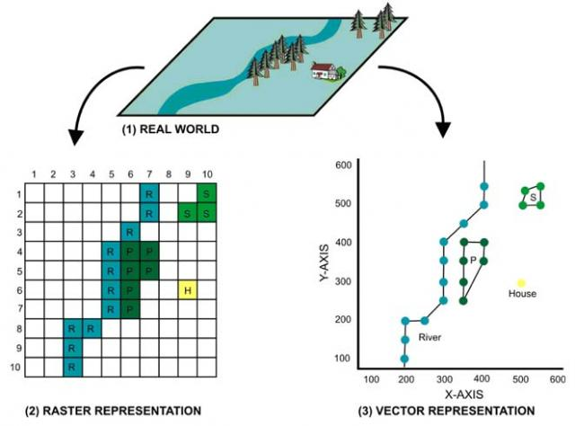

```{r setup, include=FALSE}
knitr::opts_chunk$set(echo = TRUE, warning = FALSE, message = FALSE, fig.align="center")
```

```{r}
library(tidyverse)
```

## Maps with ggplot2

Only with ggplot we can create an interesting variety of maps. 

The function `map_data` that is included in `ggplot2` package retrieves the data we need to plot country limits. 

```{r}

library(ggplot2)
head(map_data("world"), 15)

```
There is one point per vertex. The vertices define the limits of the country. When we connect two vertices with an edge we get the limits of the country. 
We can use ggplot to visualize this data as follow:

```{r}

map_data("world") %>% 
  ggplot() +
  geom_polygon(aes(x=long, y=lat, group=group))

```
Using grouping: `group=group` is very important to draw the polygons correctly. Otherwise we will get all sort of strange plots. 

Or we can alternatively use

```{r}

map_data("world") %>% 
  ggplot() +
  borders(fill="gray")
```

We can use this map and overlay any other data we want. E.g. Points, use numerical or categorical data to color the countries in the same way we normally use ggplot.  

The data only needs to have lat-lon info:

```{r}

rladies <- read_csv("data/RLadiesChapters.csv")
head(rladies)

```

And we can create a map to visualize the data

```{r}
map_data("world") %>% 
  ggplot() +
  geom_polygon(aes(x=long, y=lat, group=group),colour = "gray85", fill = "gray80") +
  #borders(colour = "gray85", fill = "gray80") +
  geom_point(data = rladies, 
             aes(x = lon, y = lat, size = members), 
             colour = "purple", alpha = 0.5) + 
  scale_size_continuous(range = c(1, 8), breaks = c(250, 500, 750, 1000)) + 
  labs(size = "Followers") + 
  ggtitle("R-Ladies chapters around the world") +
  theme_minimal() 

```


We can also subset the data to get only a region:

```{r}


# countries in South America

countries <- c("Chile", "Argentina", "Brazil", "Peru", "Bolivia",
               "Uruguay", "Paraguay","Colombia", "Ecuador","Venezuela",
               "Guyana","Suriname","French Guiana", "Guyane")

#population <- c(18,44,209.5,32,11.3,3.5,7,50,17,29,0.7,0.5,0.2)

map_sa <- map_data("world") %>% 
  filter(region %in% countries) %>% 
  ggplot(aes(x=long, y=lat)) +
  geom_polygon(aes(group=group, fill=region), color = "#838383") +
  theme_minimal() +
  theme(legend.position = "none") 

map_sa

```

If we want to create labels we can also use a `summarise`function, and we can create our own "theme" to make the map look how we want:

```{r}

labels_data <- 
  map_data("world") %>% 
  filter(region %in% countries) %>% 
  group_by(region) %>% 
  summarise(long = mean(long), lat = mean(lat)) 

theme_xy_blank <-   theme(
  axis.text.x = element_blank(),
  axis.text.y = element_blank(),
  axis.ticks = element_blank(),
  axis.title.x=element_blank(),
  axis.title.y=element_blank(),
  panel.grid.major = element_blank(), 
  panel.grid.minor = element_blank(),
  panel.background = element_rect(fill = "#3b727c",colour = "black"))

map_sa +
  geom_text(data = labels_data,
            aes(label = region), 
            size = 3.5, hjust = 0.5, angle=-45) +
  theme_xy_blank 
```


We can combine it with other data sets that also have lat-lon info. 
I want to create a map that shows in which month the Scarlet Flycatcher was observed in South America. I load the data and do some pre-procesing

```{r}
library(lubridate)
load("data/Pyrocephalus-rubinus.RData")

head(birds_df)

```

```{r}

birds_df <- birds_df %>%
  filter(species_observed & latitude<10) %>%  
  select(latitude, longitude, observation_date) %>% 
  mutate(month = month(observation_date))

birds_df <- sample_n(birds_df, 5000)
```


And now we can plot the data:

```{r}

map_bird <-  map_data("world") %>% 
  filter(region %in% countries) %>% 
  ggplot(aes(x = long, y = lat)) +
  geom_polygon(aes(group = group), color = "#838383") +
  geom_point(data = birds_df,aes(x = longitude, y = latitude, color = month)) +
  scale_colour_gradient2( low = "#e6bbad", 
                          mid = "#72bcd4",  
                          high = "#e6bbad",  
                          midpoint = 6) +
  theme_xy_blank + 
  labs(col="Month observed")

map_bird
```

Depending on how used you are to looking at South America maps your eyes might be hurting already for 15 minutes. Because the map looks really awful. And look what happens if we try to export it:


## Working with shape files and rasters


We have a problem when we only use ggplot to create maps. The maps look weird. I can change the ratio of the image and male it look even worst. 
To avoid this we need to use specific tools to manage spatial data. 

We have to use specific tools designed to manage spatial data. 

<center>


</center>

Raster and vector files also have metadata. The metadata includes which representation of the earth is used. 

## Ploting shape files in r

The package `rnaturalearth` also allows us to get data with shape format. To manage this type of data we need the package `sf` (or it´s predecessor `sp`). This package will also allow us to load shape files (.shp) saved in our PC. 

```{r}
library(rnaturalearth)
library(sf)

world <- ne_countries(scale = "medium", returnclass = "sf")  #function to get polygons of countries
head(world[,c(1:5,64)])

```

This data types have information on how the earth should be represented in a 2D dimensional map, and will take care on keep constant proportions between lat-lon and other properties (areas, distances, angles, etc.) constant.

```{r}
st_crs(world)
```

So let`s have a quick look on how this works:

<center>

</center>

Incorporate it to our previous map

```{r}

countries2 <- c(countries,"France", "Falkland Islands" )
 map_bird <- world %>% 
  filter(name_long %in% countries2) %>% 
  ggplot() +
  # This is the important line where we do not plot normal polygons but sf
  # objects that have a crs associated to it. 
  # Look that we do not have to specify x and y anymore because that info is
  # already in the polygons
  geom_sf(fill = "#838383") + 
  geom_point(data = birds_df, 
             aes(x = longitude, y = latitude, color = month(observation_date))) +
  scale_colour_gradient2( low = "#e6bbad",
  mid = "#72bcd4",  high = "#e6bbad",  midpoint = 6) +
  theme_xy_blank + labs(col = "Month of observation") +
  xlim(-95, -25) + ylim(-55, 20)

map_bird
```


We discussed how to plot parts of the world without the need to list the countries. One possible solution 
```{r}
world %>% 
  ggplot() +
  # This is the important line where we do not plot normal polygons but sf
  # objects that have a crs associated to it. 
  # Look that we do not have to specify x and y anymore because that info is
  # already in the polygons
  geom_sf(fill = "#838383") +
  xlim(-25, 40) + ylim(35, 70)

```


### some tricks to improve appearence


```{r, fig.width=26}

library(png)  
bird <- readPNG("imgs/py_rub.png")

map_bird + 
  annotation_raster(bird,-45,-25,-35,-55) +
  # xlim(c(-90, -25)) +
  theme_minimal() +
  theme(panel.background =element_rect(fill = "lightgray", color=NA),
        plot.background = element_rect(fill = "lightgray", color=NA),
        legend.position = c(0.10, 0.33),
        legend.text = element_text(size = 11),
        legend.title = element_blank(),
        axis.title = element_blank()) +
  annotate("text", 
           label="Scarlet flycatcher in South America",
           x= -62, y=20, 
           family="serif", 
           size =12, color = "grey20") +
  annotate("text", label = "Observation Month", x=-85, y=-24, size=8, family="serif") +
  annotate("text", label = "Data Source: e-Bird", x=-45, y=-56, size=4)
  
  
```

And you can add scale bar and north (only works when plotting polygons with georeferenced info as we did in the last plots)

```{r}

require(ggspatial)

map_bird +  
  annotation_scale(location = "bl", width_hint = 0.3) + # scale
    annotation_north_arrow(location = "br", 
                           which_north = "true", #north arrow
                           style = north_arrow_fancy_orienteering) 
```

### Plotting trajectories between two points

There are many things that we can do, for example making lines between points:

```{r}
# slave routes
slave_routes <- read_csv("data/slave_routes.csv")

# ports lat lon 
ports <- read.csv2("data/ports.csv") 

# To get cities lat lon you can run world.cities 
# from library maps that is loaded with ggplot2

slave_routes <- slave_routes %>% 
  mutate(route = paste(port_origin, port_arrival, sep ="-")) %>% 
  select(route, port_origin, port_arrival) %>% 
  gather("Point", "City", 2:3)

slave_routes <- left_join(slave_routes, ports, by="City") 

library(png)

compass <- readPNG("imgs/compass.png")

world %>% ggplot() +
  geom_sf(fill="#b9a37e") + 
  xlab("Longitude") + ylab("Latitude") +
  geom_path(data = slave_routes, 
            mapping= aes(lng, lat, group = route),
            colour = "#b05f66",size = 0.1,
            alpha = 0.5,lineend = "round") + 
  annotation_raster(compass,-105,-145,-25,-65) +
  theme_xy_blank

```

This data combination works because the crs of the world data is unprojected, and our csv has also lat lon information. But this will not be always the case. We have to be carefull when combining data to be using the same crs. 

We will see some examples where we need to transform the data in the next sections.

## Working with Rasters

The web page **worldClim** has available raster files with climatic information that cover the whole world.  the same package raster that we will use to manipulate this data type allows us to access the data

```{r}
library(raster)

worldclim <- getData('worldclim', var='bio', res=10)
plot(worldclim[[1]])
```

You can find the name of the variables and more info here:

https://www.worldclim.org/data/bioclim.html

## Combining rasters and shape files using the library `tmap`

Usually we want to visualize data that come in different formats. One typical combination is to use a raster as base map layer, for example a rater containing elevation, and then plot a shape file containing points, lines or polygons over it.  

As we mention before, R has packages that allow us to manipulate these data types:

```{r}

require(raster) #Package to work with raster files
require(sf) #Package to work with shape files

```

The functions to load these data files from our computers are:

```{r}

t_july <- raster("data/wc2.0_5m_tavg_07.tif")  # loads the raster
sites <- st_read("data/sample_sites_UTM.shp")  # loads the vector data - sites

```

### Our problem

Let's suppose he have different sampling points in Germany. We are interested in the temperature difference between summer and winter in this sites. Can we do a map to display this info? How would you do that?

#### This are some usefull links to find data:

Link to the [Federal Agency for Cartography](https://www.bkg.bund.de/DE/Home/home.html)
Link to [open BW data](https://www.lgl-bw.de/lgl-internet/opencms/de/07_Produkte_und_Dienstleistungen/Open_Data_Initiative/)
Link to [WoldClim](http://worldclim.org/version2)
link to [land use data](https://land.copernicus.eu/pan-european/corine-land-cover)
Another useful [link](https://www.eea.europa.eu)

First we can do simple calculations using the rasters. To be able to do such calculation the rasters must have the same extent, resolution and crs.

```{r}

t_july<-raster("data/wc2.0_5m_tavg_07.tif") # loads the raster
t_december<-raster("data/wc2.0_5m_tavg_01.tif") # loads the raster

# Get temperature range
t_diff <- abs(t_july - t_december)
plot(t_diff, main = "Temperature range")
```

Raster calculation is relatively straight forward using R if the raster have the same resolution. If the raster come from different sources you usually have to re-shape one raster. 

more info [here](https://rspatial.org/spatial/4-rasterdata.html)

#### Load the shape files 

We already loaded the shape file containing the sampling sites. These sites are in Germany. We will get the shape of Germany to also use in our map

```{r}

#get germany voundaries from world R data
germany <- world %>%  dplyr::filter (name == "Germany")

```

#### Check reference system

Specially when we work with data coming from different sources, we have to check that the coordinate reference system match. If the referent system is not consistent we can have problems with ploting but also while ding calculations. 

```{r}

# The function to get the coor. system is different between shapes and rasters
st_crs(germany)$proj4string#get the projection
st_crs(sites)$proj4string#get the projection
crs(t_diff)#get the projection

st_crs(germany)$proj4string == st_crs(sites)$proj4string
st_crs(germany)$proj4string == crs(t_diff, asText = T)


```

The data do not have the same coord. reference system. We have to transform one. 

```{r}
sites_transformed <- st_transform(
  sites, 
  crs = crs(t_diff, asText = T)
  )# transform coordinate sistem
germany_transformed <- st_transform(
  germany, 
  crs = crs(t_diff, asText = T)
  ) #transform coordinate 

```

#### Crop the raster to the shape file extent


Since we are only interested in Germany, we want to crop the raster to have values only on the extent of the country.
To do that we need to speps, crop and mask the raster.

We get the extent (the coordinates of the extreme points) for our shape file of Germany. This is the information that we will use to crop the raster.

```{r}
germany_extent <- extent(germany_transformed)
germany_extent
```


```{r}
# crop the land use data by the extend of BW. Crop funciton from the raster package
crop_tdiff <- crop(t_diff, germany_extent, snap = "out")
plot(crop_tdiff)

```

In order to get a raster that matches exactly with the shape, we have to mask it. 
We could also do this step without cropping first, but that would be much more computational intensive. 

```{r}
mask_tdiff <- mask(crop_tdiff, germany_transformed)
plot(mask_tdiff)
```

#### Use `tmap` to plot rasters and polygons

The library tmap is another grate option to build thematic maps. I find it very useful to work with raster data. Useful info can be found in the [tmap vignette](https://cran.r-project.org/web/packages/tmap/vignettes/tmap-getstarted.html). Another library to plot raster data is `rasterVis`. We will not cover it today but you can check the [vignette](https://oscarperpinan.github.io/rastervis/) 
You can plot many layers together. Each needs some reference(point, raster, text, etc.)

`tmap` follows a similar logic to `ggplot2` but adapted to working with geographical data. 
In this example, we add each layer with `tm_shape()` and work on it's appearence:

```{r}

require(tmap)

tmap_mode("plot") # static plot or leaflet. 
tmap_style("classic")


tm_shape(mask_tdiff) + 
  tm_raster(col = "layer", 
             style = "cont", 
             n = 10,  
             title = "Temperature Difference") +
tm_shape(germany_transformed) + #add ploygon of germany
  tm_borders() +
tm_shape(sites_transformed) +
   tm_symbols(col = "gray", scale = .5)+ ##add points
      tm_text("Site", # Column where the text is saved
              size = 0.8,  
              ymod = -0.6, 
              root = 1, 
              size.lowerbound = .60,
              bg.color="gray", 
              bg.alpha = .5) +
tm_layout(inner.margins = c(0.15, 0.40, 0.10, 0.1), # crop the extent of the map
          legend.position = c("left","bottom")) +
tm_compass(type = "8star", 
            position = c("LEFT", "TOP")) + # add north
tm_scale_bar() #+ #add scale
#tm_style_classic 

```

```{r}

tmap_mode("view") # static plot or leaflet. 
tmap_style("cobalt")


tm_shape(mask_tdiff) + 
  tm_raster (col= "layer" , style = "cont", n=10,  title = "T. Difference") +
tm_shape(germany_transformed) + #add ploygon of germany
  tm_borders() +
tm_shape(sites_transformed) +
   tm_symbols(col = "gray", scale = .5)+ ##add points
tm_layout(inner.margins = c(0.15, 0.30, 0.10, 0.1)) + # crop the extent of the map
tm_layout(legend.position = c("left","bottom")) + # add legent
    tm_compass() + # add north
  tm_scale_bar() #add scale


```


With tmap is really easy to do interactive maps! 


`tmap` is a grate library to make maps. Check the [vignette](https://cran.r-project.org/web/packages/tmap/vignettes/tmap-getstarted.html)


## Tmap example with world data

Example from https://gotellilab.github.io/Bio381/StudentPresentations/SpatialDataTutorial.html

```{r}

tmap_mode("plot")
data(metro)
metro$growth <- (metro$pop2020 - metro$pop2010) / (metro$pop2010 * 10) * 100


mapWorld <- 
  tm_shape(world) +
    tm_polygons("income_grp", 
                palette = "-Blues", 
                contrast = .7, 
                id = "name", 
                title = "Income group") +
  tm_shape(metro) +
    tm_bubbles("pop2010", col = "growth", 
               border.col = "black", 
               border.alpha = .5, 
               style = "fixed", 
               breaks = c(-Inf, seq(0, 6, by=2), Inf),
               palette = "-RdYlBu", contrast=1, 
               title.size = "Metro population", 
               title.col = "Growth rate (%)", 
               id = "name") + 
    tm_style("gray") 

mapWorld
```

```{r}
data(World, metro)
metro$growth <- (metro$pop2020 - metro$pop2010) / (metro$pop2010 * 10) * 100

mapWorld <- tm_shape(World) +
    tm_polygons("income_grp", 
                palette = "-Blues", 
                contrast = .7, id = "name", 
                title = "Income group") +
    tm_shape(metro) +
    tm_bubbles("pop2010", col = "growth", 
               border.col = "black", border.alpha = .5, 
               #style="fixed", 
               breaks = c(-Inf, seq(0, 6, by=2), Inf),
               palette = "-RdYlBu", contrast=1, 
               title.size = "Metro population", 
               title.col = "Growth rate (%)", id = "name") + 
    tm_style_gray() + tm_format("World_wide")

mapWorld
```
During the Meetup we had some problems with deprecated functions. In the following link you find the deprecated fuctions and the new ones:

https://www.rdocumentation.org/packages/tmap/versions/3.2/topics/deprecated_functions

### It is also possible to plot facets


```{r}

metro_long <- metro %>%
  gather("year", "population", 4:12) %>% 
  filter(year %in% c("pop1950", "pop2020"))

tmap_style("natural")
tm_shape(world) +
  tm_polygons(col = "#d6af78") +
tm_shape(metro_long) +
  tm_bubbles(c("population"), 
             title.size = c("Population"),
             contrast = 1 ) +
	tm_layout(panel.labels = c("1950", "2020")) +
  tm_facets(by=  c("year"), ncol = 1, showNA = FALSE)
```

# Resources

Tmap Vignette: 
https://cran.r-project.org/web/packages/tmap/vignettes/tmap-getstarted.html

Geocomputation:
https://geocompr.robinlovelace.net/adv-map.html

Different nice examples:
https://www.r-spatial.org/