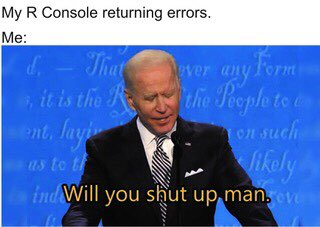
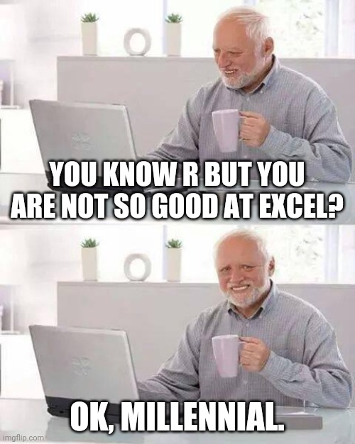

# Welcome to R!

{width=50%}

All artwork by Allison Horst (@allisonhorst) unless otherwise noted.


*Why should you learn R?*

It's...

- totally free!

- open-source

- a scripting language (reproducible and transparent)

- an established tool with tons of tutorials and help pages 

- an amazing and inclusive community 

{width=40%}


## (1) First steps

R = programming language that can be written directly into your computer's console/terminal

R-Studio = integrated development environment (IDE) with lots of features

Almost all R-users have both installed 


### R-Studio

Four panels: 

Top-left: scripting panel -- write and save code (may only open when you open a new file)

Bottom-left: console panel -- input/output that won't be saved

Top-right: environment panel -- dataframes, variables (and sometimes has other features too, depending on what you're working with)

Bottom-right: install and update packages, preview plots, read help files, and some other features


### R script (.R)

File -> New File -> R Script 

- simple: only code

- write lines of code in the order they are meant to be run

- run each line by clicking that line and pressing Control + R (on Windows) or Cmd + Enter (on Mac)

- output shows below, in console panel (number in bracket shows amount of output if there is more than one line)

- Try it out: 5 + 5 

- comments that are not read as code: #


### R-Markdown file (.Rmd)

File -> New File -> R Markdown

- R-Markdown: more complex, both code and text, can also include images and some basic formatting (## for headers)

- YAML information at top:

  ---
  title: "Intro to R"
  author: "Kyla McConnell"
  date: "12/21/2020"
  output: html_document
  ---

{width=60%}

- text in whitespace = text (unlike in an R script)
  - keep notes or leave a record of your decisions

- code needs a code chunk -- type it with three backticks or use Insert in the top bar and select R
  
```{r}

```

Run code: 
- press Control + R (on Windows) or Cmd + Enter (on Mac) with your cursor in the line
- use green right-pointing arrow at right edge of code block
- arrow with line under it -> runs all code chunks above (but not the current one)

Output: 
- directly below code block in preview window

- Can also use (#) to denote lines that are comments and shouldn't be read as R code

#### Try it out

1. Add a new (R) code block below this text. One of R's most basic functions is as a (fancy) calculator. Try the following operations: 542 + 345, 67 * 29, 143/3

2. What happens if you chain together multiple operations? Try: 12 + 2 * 2 and (12 + 2) * 2 in an additional code block

3. Can you figure out what the following symbols mean in R: ^, %% ? Add another code block and give them a try. (Hint: %% is related to /)


{width=50%}

## (2) Variables

### Simple variables

Variables: give name/label to output, saves it (can be used anywhere below in current script)

name_of_variable <- code

For example:
```{r}
num_cats <- 12

num_cats * 3
```


```{r}
num_dogs <- 7

num_pets <- num_cats + num_dogs
```

```{r}
num_pets
```


```{r}
double_cats <- num_cats * 2
double_cats
```

- Variables are case sensitive (caps/lowercase matters) and can't include spaces.
- Commonly snake_case 

- You can preview your current variables in the R-Studio environment pane

#### Try it out

1. You are planning a pizza party and want to figure out how many pieces of pizza each of your guests can eat before the pizzas run out. Create a variable called "guests" and assign it to the number of guests you have at your party: 15. (First, make a code block under this question!)

2. You order 5 pizzas. Assign the variable "pizzas" to the amount of pizzas you have: 6. Each pizza has 12 slices. Assign the variable "slices" to the amount of slices you have over all pizzas (hint: multiple the slices per pizza by the total number of pizzas -- you can use the pizzas variable here instead of retyping the number)

3. Divide your "slices" variable by your "guests" variable to figure out how many slices each person can have. 

4. 5 more people arrive to the party uninvited. Update your "guests" variable to the total number you have now. How many slices can each person have now?

{width=50%}

### Vectors

If you want to have multiple items of the same type:
  - Use a *vector* -- enclosed in the syntax `c()`

- command `length()` returns number of items in the vector

```{r}
my_numbers <- c(12, 14, 26, 57, 82)

length(my_numbers)
```

You can also do "vector-wise" operations:
```{r}
my_numbers + 2

my_numbers ^ 2

my_numbers / 10
```

Mathematical operation is "broadcast" to each item


Add/subtract/multiply/divide a vector by another vector: items matched up one at a time in a loop

```{r}
my_numbers + my_numbers
```


You can also take a certain item from a vector using square brackets. For example, take the first item:

```{r}
my_numbers[1]
```

#### Try it out

1. Make a variable called long_array and assign it the values 1, 1, 2, 2, 5, 10 (don't forget the `c()` syntax!)
2. Make a variable called short_array and assign it the values 1, 6, 10
3. Subtract short_array from long_array
4. Subtract long_array from short_array
5. Look at the output. What does this tell you about how R deals with vectors of different lengths?

## (3) Data types

- Data types -- how R interprets the input you give it
- Figure out what type something is with `class()` 

### Numeric

```{r}
class(8.8)
class(4.5113)
class(2)

fav_number <- 12

class(fav_number)
```

- Numbers generally treated as *numeric* -> can include decimals 

### Integer

- *integer* allows only whole numbers -> can force numbers into this form with `as.integer()`
  - this will truncate the decimal (cut it off), not round

```{r}
as.integer(8.8)

integer_variable <- as.integer(8.8)

integer_variable
class(integer_variable)
```

### Character

- *character* is text, always enclosed in either double or single quotation marks 

```{r}
class("hello")
```

Uncomment the following line by deleting the hashtag (#). Check out the error here -- it may sound confusing but try to identify what it is telling you.

```{r}
my_word <- "hello"
class(my_word)

#my_word + 2
```

If you forget the quotes, you'll also get an error (have to remove the comment character here to see it!)
```{r}
#my_name <- Kyla
```

{width=50%}

### Logical
- *logical* can be either TRUE or FALSE, nothing else. 

test if something is identical with ==
test if something is not identical with !=
test if something is greater than with > or less than with <
or try greater than or equals to >= or less than or equal to with <=

```{r}
7 < 8

"dog" == "dogs"

8.8 >= 5.6

"seven" == 7

class("seven" == 7)
```

{width=50%}

### Factor
*factor* - string variables that should be treated as categories / distinct levels of a grouping -> will become more relevant when we work with datasets

- Allows you to represent text as group labels, that multiple items can belong to

```{r}
fav_flavors <- c("chocolate", "vanilla", "strawberry", "strawberry", "chocolate", "mint chocolate chip", "chocolate",  "vanilla", "strawberry", "chocolate")

class(fav_flavors)

summary(fav_flavors)
```

Change to factor with `as.factor()`
```{r}
fav_flavors <- as.factor(fav_flavors)

class(fav_flavors)

summary(fav_flavors)
```

Can also see the possible groupings of a factor using `levels()`
```{r}
levels(fav_flavors)
```


#### Try it out

1. Assign your name to the variable "my_name". What data type is the variable?
2. Try the command `nchar()` on your name variable. What does it do? Try also `toupper()`.
3. What does nchar(my_name) >= 4 return? What does this mean?

Bonus: What does TRUE == 1 return? What about FALSE == 1? Try them both with 0 too. What does this tell you about how R deals with logical variables?

## (4) Packages

### Installing packages

*Packages* - extend basic R functions to add more complicated/specialized functionality

- CRAN: R Consortium's host for packages -- any advanced R-programmer can make and submit their packages, any R-user can download and use them

- Install packages once when you first use them
  - command in console (or Markdown): `install.packages("packagename")`
  - or use the panel at the lower right, under the Packages tab

Try it now with one of the most used packages by copying the following code into your console `install.packages("tidyverse")`


### Using packages

- `library()` command at beginning of script to use calls from that package -- will only work if you've already installed the package

- Good style: load all packages in first code block

- Error about not finding a package? You probably don't have it installed. 

```{r}
library(tidyverse)
```


In summary: You need to install a package once, but need to load it (using the library command) every time you start a new R session.  

#### Try it out

1. Try the following command:
```{r}
#beep(2)
```
What error message do you get?

Now install the package "beepr" and call the package to this session with a library call somewhere above the beep command (line above is enough.) Try running the command again (make sure your speakers are on -- but not too loud :D) 

2. Install and -load- the "cowsay" package and try the following command:
```{r}
#say(what = "Good luck learning R!", by = "chicken")
```


## (5) Reading in data

- What type of file are you working with?
  - Excel: go to File -> Save As and select either comma-separated values (csv) or tab-separated values (tsv)
  - Or: open the file in a text editor to see what is used to separate the columns

- Where is the file saved?

  - working directory: the location that R should start looking for files -- `setwd()`
    - ex: `setwd(~Users/kyla/Documents...)` or `setwd(C:/Documents...)`
    - can also use Session -> Set Working Directory -> Choose Directory...
  - R-Markdown automatically sets the working directory to the folder you're in
  
  - once you've set the working directory:
    - can use files with just their short names ("experiment_data.csv")
    - can use data in a folder ("data/experiment_data.csv")
    - can use ../ to go backwards one folder

- Read in the file:
  - base-R: `read.csv()` and `read.tsv()`
  - tidyverse (improvements, reads as tibble instead of dataframe): `read_csv()` and `read_tsv()`
    - must have tidyverse installed and loaded with a `library()` call
    - note: `read_csv2()` for csv files in languages that use a comma as a decimal separator and thus a semicolon as a csv separator 
    - alternatively: read_delim(file, delim = "")
    
*Save the output to a variable.*


{width=40%}

```{r}
jump_data <- read_csv("jump.csv")

jump_data <- read_delim("jump.csv", delim = ",")
```


## (6) Exploring your data

Now you have a data file read in, but how do you see what's in it?

`head()`: shows first six rows 
```{r}
head(jump_data)
```

Can change the amount of rows with the n *argument* 
```{r}
head(jump_data, n=3)
```

Or: click name of dataframe in Environment tab
  - can also sort columns and Filter rows -- just for viewing purposes
  - bit slow if you start having huge dataframes but often a good first look

`summary()`: call it on a dataframe to get each column and useful info based on the data type. For example, numeric columns will show the min, median, max and the quartiles (25% increments).
```{r}
summary(jump_data)
```

#### Try it out

1. Download the three "penguin_data" files and save them in the same location as this Markdown. They all contain the same data, but it's saved in slightly different formats, so you need to read them each in with a different command. Make sure to save them to variables.
2. Take a look at your dataframe in the Environment tab. 
3. Try the command `colnames()` on the variable you saved the dataframe to. What does it do?
4. We already tried the `head()` command, now try the `tail()` command. What does it do?


## (7) Columns

- specific column call with dataframe_name$column_name

R-Studio will helpfully suggest the column names as soon as it sees the $
```{r}
jump_data$participant
```

```{r}
jump_data$height_cm
```

### Descriptive stats

Basic descriptive statistics for numeric columns -- mean, median and range 

```{r}
mean(jump_data$height_cm)
```

```{r}
range(jump_data$height_cm)
```

```{r}
median(jump_data$height_cm)
```

```{r}
summary(jump_data$height_cm)
```


#### Try it out

1. Use the penguin dataset. What is the range of flipper lengths?
2. Save the mean body mass to a variable called "average_bodymass". This number is in grams. What would the equivalent be in kilograms? Hint: Divide by 1000.


### Categorical columns

The penguins data contains information on several different penguin species. But how many, exactly? Let's try to use 'summary' to extract that information:
```{r}
penguins <- read_tsv("penguin_data_3.txt")

summary(penguins$species)
```
- Summary on a character column shows that each entry is seen as different and not comparable.
- This is a character (the default for text data)
- But should be a factor
- Factors represent groups (participant, conditions, etc.)
- We can use `class` on a variable to have R show us which data type it is:

```{r}
class(penguins$species)

class(penguins$bill_length_mm)
```

- Change a character column into a factor using `as_factor()` 
  - Overwrite the original column

```{r}
penguins$species <- as_factor(penguins$species)

class(penguins$species)

summary(penguins$species)
```

- Quick reference: check the environment tab upper-right

#### Try it out
1. Which other variables in the penguins data should be factors? Change them using the same code we used above.
2. How many entries from penguins who live on the "Dream" island are there?


## (8) The pipe operator

The pipe %>% is a command from the magrittr package (which is included in tidyverse, so no need to load it explicitly). 
When the pipe is used, the output from the first line is automatically passed to the second line. Specifically, the output is used as the first argument of the next command.
Use Control + Shift + M to automatically insert %>% 

```{r}
summary(penguins)
# is equivalent to:
penguins %>% # the line break here is optional, but makes the code more readable
  summary()

head(penguins, n = 4)
# is equivalent to:
penguins %>% 
  head(n = 4)
```

#### Try it out
Look at the last three lines of the penguins data (hint: `tail`). Use the base R command, then try to rewrite it with the pipe %>% 

{width=50%}

## (9) Conclusion

- Installed R, R-Studio
- R-Markdown 
- variables
- data types: numeric, integer, character, factor, vector
- installing & loading packages
- reading in files 
- looking at dataframes in R  

Next time:  
- tidyverse  
- rename columns  
- make new columns  
- reorder  
- filter based on condition  
- etc.

{width=80%}

### Reading

As a follow-up to this tutorial, you might want to read chapters 3.3 - 3.9 in Navarro, Learning Statistics with R (p. 46 - 66).
