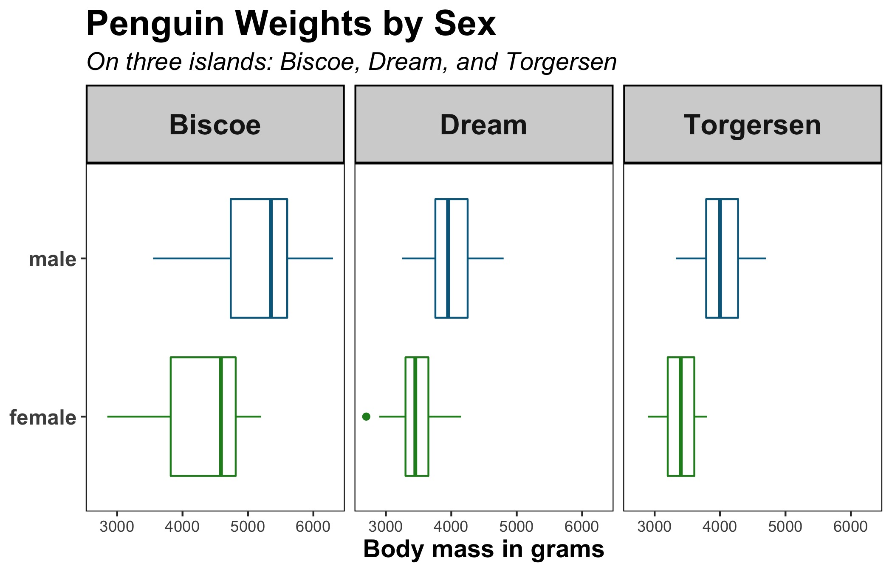

# What do themes do?

Themes let you customize, as the documentation puts it, the "non-data components" of plots, namely:
- titles (e.g. change colour, size, orientation, position)
- labels
- fonts (more on those next month!)
- background (colour)
- gridlines (colour and line type)
- legends

## Packages, data, graph
To get started, let's load the {tidyverse}, some data and create a graph:
```{r}
library(tidyverse)

penguins <- read_csv('https://raw.githubusercontent.com/rfordatascience/tidytuesday/master/data/2020/2020-07-28/penguins.csv') %>% 
  drop_na()

p1 <- ggplot(penguins) +
  aes(x = bill_length_mm, y = bill_depth_mm, fill = species, colour = species) +
  geom_point() +
  geom_smooth(method = "lm") +
  labs(x = "Bill length", 
       y = "Bill depth",
       title = "Bill length and depth",
       subtitle = "Palmer penguins",
       caption = "Data source: Tidy Tuesday Github",
       tag = "Graph (1)",
       fill = "Penguin species",
       colour = "Penguin species")

p1
```


## Built-in ("complete") themes

R offers several built-in themes. By default, R uses theme_gray(), so if we add that to our plot, it looks exactly the same:
```{r}
p1 +
  theme_gray()
```

Here are the other options:
```{r}
p1 +
  theme_bw()
```

```{r}
p1 +
  theme_classic()
```

```{r}
p1 +
  theme_dark()
```

```{r}
p1 +
  theme_light()
```

```{r}
p1 +
  theme_linedraw()
```

```{r}
p1 +
  theme_minimal()
```

```{r}
p1 +
  theme_test()
```

```{r}
p1 +
  theme_void()
```

As you can see, they change the appearance of the plot in different ways. For example, theme_dark() colours the plot background a dark gray, theme_minimal makes the gridlines a light gray, and theme_void removes them, axes lines and labels altogether (which is useful for e.g. maps).

## Themes with the {ggthemes} package

The {ggthemes} package contains some more pre-set themes that make your plots look as if they're e.g. from The Economist, Fivethirtyeight, or made with Google docs:
```{r}
#install.packages("ggthemes")

p1 + ggthemes::theme_economist()

p1 + ggthemes::theme_fivethirtyeight()

p1 + ggthemes::theme_gdocs()
```


# Custom themes with theme()

Most elements of a plot are text elements (title, subtitle, axes labels), lines (such as the axes and gridlines), and rectangular boxes (such as the plot background). The corresponding options in theme() are:
element_text()
element_line() and
element_rect().

Additionally, element_blank() is a useful shorthand for removing something (e.g. the legend).


## element_text()

Where do you have text elements in a ggplot?


Source: https://i0.wp.com/cmdlinetips.com/wp-content/uploads/2021/05/ggplot2_theme_element_text_tricks.png?w=624&ssl=1

How can you modify them? Here are the arguments of `element_text()`:
```{r}
element_text(
  family = NULL, # font
  face = NULL, # bold or italics
  colour = NULL,
  color = NULL, # both spelling variants work!
  size = NULL,
  hjust = NULL, # horizontal adjustment
  vjust = NULL, # vertical adjustment
  angle = NULL,
  lineheight = NULL,
  margin = NULL,
  debug = NULL,
  inherit.blank = FALSE
)
```

Let's change some text elements:
```{r}
p1 + theme(
  text = element_text(colour = "red")
)

p1 + theme(
  text = element_text(face = "bold")
)
```
This will come in handy when you want to apply a custom font (which we'll cover next month =)).

### Modifying the title and subtitle
You can also modify specific text fields.

First, we'll play around with some colour, font sizes and faces:
```{r}
p1 + theme(
  plot.title = element_text(colour = "yellow",
                              size = 22,
                              face = "bold"),
  plot.subtitle = element_text(colour = "orange",
                               face = "italic",
                               size = 18)
)
```

But we can also change the position of text with `vjust` and `hjust`.
`hjust` = horizontal alignment
```{r}
p1 + theme(
  plot.title = element_text(
    hjust = 1 #right-aligned
  ),
  plot.subtitle = element_text(
    hjust = 0 #left-aligned
  )
)

p1 + theme(
  plot.title = element_text(
    hjust = 0.5 #centered
  ),
  plot.subtitle = element_text(
    hjust = 0.5 #centered
  )
)
```

`vjust`= vertical alignment
```{r}
p1 + theme(
  plot.title = element_text(
    vjust = 5 # moves the title up
  ),
  plot.subtitle = element_text(
    vjust = -5 # moves the subtitle down
  )
)
```

Alternatively, a newer addition to `theme()` lets you deal with the alignment of titles, subtitles, and captions. By default, it aligns to the panel area, but adding "plot" instead aligns to the plot margin:
```{r}
p1 + theme(
  plot.title.position = "plot", # aligns the subtitle, too!
  plot.caption.position = "plot"
)
```

Additionally, we can use `margin()` to add space around the title. This works for other labels, too (and the entire plot - example later). It has four arguments: t (top), r (right), b (bottom), l (left). Helpful reminder: TRouBLe
```{r}
p1 + theme(
  plot.title = element_text(
    margin = margin(15, 0, 15, 0))
)
```

For multi-line text, you can modify the line spacing with `lineheight`:
```{r}
p1 +
  labs(title = "Bill length\nand depth") +
  theme(plot.title = element_text(lineheight = 0.7))

p1 +
  labs(title = "Bill length\nand depth") +
  theme(plot.title = element_text(lineheight = 1.5))
```


### Modifying the x- and y-axis labels
```{r}
p1 + theme(axis.title.x = element_text(size=16, 
                                      color="darkgreen", 
                                      face="italic",
                                      angle=45))
```

hjust:
0 is left-aligned, 1 is right, 0.5 middle

vjust: move text up (positive numbers) or down (negative numbers)
```{r}
p1 + theme(axis.title.x = element_text(size=16, 
                                      color="darkgreen", 
                                      face="italic",
                                      vjust = -2))
```

How could you modify the y-axis label? Try it!

By the way: you can modify both axis labels at the same time with axis.title!
```{r}
p1 + theme(axis.title = element_text(size=16, 
                                      color="orange", 
                                      face="bold"))
``` 

element_blank() removes the element - this code gets rid of both x- and y-axis labels
```{r}
p1 + theme(axis.title = element_blank())
```


### Modifying the axis ticks
```{r}
p1 + theme(axis.text.x = element_text(size=8, 
                                      color="red", 
                                      face="bold",
                                      angle=45))
```

...axis.text.x for x-axis labels, axis.text.y for y-axis labels
axis.text for ticks on both the x- and the y-axis

It's also possible to rotate the text with `angle()`:
```{r}
p1 +
  theme(axis.text.x = element_text(angle = 45),
        axis.text.y = element_text(angle = 90))
```


### Modifying caption and tag
```{r}
p1 + theme(
  plot.caption = element_text(colour = "purple",
                              size = 12,
                              hjust = 0.5,
                              face = "bold.italic"),
  plot.tag = element_text(colour = "pink",
                          size = 14)
)
```


## element_line()

Here's a (slightly overwhelming-looking) overview of all the line elements in a plot:

Source: https://i1.wp.com/cmdlinetips.com/wp-content/uploads/2021/05/ggplot2_element_line_tips.png?w=660&ssl=1

```{r}
element_line(
  colour = NULL,
  color = NULL,
  size = NULL,
  linetype = NULL,
  lineend = NULL,
  arrow = NULL,
  inherit.blank = FALSE
)
```


### Modify x- and y-axis lines
First, let's colour both the x- and y-axis lines blue and increase their size:
```{r}
p1 + theme(
  axis.line = element_line(colour = "blue",
                             size = 3)
)
```

Now, we'll also use a different line type:
```{r}
p1 + theme(
  axis.line.x = element_line(colour = "blue",
                             size = 3,
                             linetype = "dashed")
)
# is equivalent to:
p1 + theme(
  axis.line.x = element_line(colour = "blue",
                             size = 3,
                             linetype = 2)
)
```

Available line types:
0 = "blank", 1 = "solid", 2 = "dashed", 3 = "dotted", 4 = "dotdash", 5 = "longdash", 6 = "twodash"

Adding arrows is also possible:
```{r}
p1 + theme(
  axis.line = element_line(arrow = arrow())
)
```


And the line ends can be changed:
```{r}
p1 +
  theme(
    axis.line = element_line(lineend = "round",
                             size = 2)
  )
```
Available line ends:
"round”, “butt” (the default), or “square”

### Modify ticks on x- and y-axis

```{r}
p1 + theme(
  axis.ticks = element_line(colour = "red",
                             size = 2)
)
```

### Modify major and minor grid lines

```{r}
p1 + theme(
  panel.grid.major = element_line(colour = "black",
                                  linetype = "dashed",
                                  size = 0.2),
  panel.grid.minor = element_line(colour = "darkgray",
                                  linetype = "dotted",
                                  size = 0.5))
```
Again, it's possible to add .x or .y to only modify the grid lines on the x- or y-axis.

It's also possible to remove lines with `element_blank()`:
```{r}
p1 + theme(
  panel.grid.minor = element_blank()
)

p1 + theme(
  panel.grid.major = element_blank()
)

p1 + theme(
  panel.grid = element_blank()
)
```

It's also possible to change the placement and amount of grid lines. Since they're dependent on the axes breaks, that's what we have to change with `scale_x_continuous` or `scale_y_continuous`:
```{r}
p1 +
  scale_y_continuous(breaks = seq(12, 22, 2),
                     minor_breaks = seq(12, 22, 0.5)) +
  scale_x_continuous(breaks = seq(35, 60, 5))
```

```{r}
p1 +
  scale_y_continuous(breaks = seq(12, 22, 2),
                     minor_breaks = seq(12, 22, 0.5)) +
  scale_x_continuous(breaks = seq(35, 60, 5)) +
  theme(axis.ticks.x = element_line(colour = "red",
                             size = 2),
        axis.ticks.y = element_line(colour = "blue",
                                    size = 2))
```


## element_rect()
Finally, with `element_rect()`, anything to do with the panel or plot background can be changed.

For example, we can change the background to yellow and the line around it to orange (and also make that line wider):
```{r}
p1 +
  theme(
    panel.background = element_rect(
      fill = "yellow",
      colour = "orange",
      size = 4)
  )
```
Exactly the same as in `aes()`, fill is for larger areas and colour for smaller spaces (here, the line).

To change the colour of the space around the panel:
```{r}
p1 + theme(
  plot.background = element_rect(fill = "lightgray",
                                 colour = "darkgray",
                                 size = 3)
)
```

To get both these boxes to be the same colour, either specify it in `plot.background` *and* `panel.background`, or set one of those two panels to be transparent:
```{r}
p1 +
  theme(panel.background = element_rect(fill = "transparent"), # or NA
        plot.background = element_rect(fill = "lightgray",
                                       color = "darkgray", size = 3))
```

## Modifying the legend
We can change the legend title and text in the same way as we've changed other text elements:
```{r}
p1 + theme(
  legend.title = element_text(colour = "aquamarine",
                              size = 10),
  legend.text = element_text(colour = "gray",
                             size = 8)
)
```

To remove the legend completely:
```{r}
p1 + theme(
  legend.position = "none"
)
```

Or, to remove the legend title only:
```{r}
p1 + theme(
  legend.title = element_blank()
)
```

`legend.position` also lets you move the legend around:
```{r}
p1 + theme(
  legend.position = "top")

p1 + theme(
  legend.position = "bottom")

p1 + theme(
  legend.position = "left") # "right" is the default
```

It's also possible to do that manually:
```{r}
p1 + theme(
  legend.position = c(.85, .15)
)
```

To make sure the legend doesn't cover parts of the plot, we can make the background transparent:
```{r}
p1 + theme(
  legend.background = element_rect(fill = NA),
  legend.position = c(.85, .2))
```


## Margins
To increase the space around the graph, use `plot.margin = margin()`:
```{r}
p1 +
  theme(plot.margin = margin(t = 1, r = 1, b = 5, l = 1, unit = "cm"))
```


## Theme options with facet_wrap

Quick `facet_wrap()` intro/reminder: This lets you introduce an additional variable to facet by - ggplot will create separate plots for each level of the variable. Here, we're still looking at bill depth and length by different penguin species, but the penguins on each island are displayed separately.
```{r}
p1 +
  facet_wrap(~ island)
```

You can change the properties of the "strip" (= box that contains the island names) with `theme()`:
```{r}
p1 +
  facet_wrap(~ island) +
  theme(
    strip.text = element_text(colour = "darkgreen",
                              face = "bold",
                              size = 16,
                              hjust = 0),
    strip.background = element_rect(fill = "yellow",
                                    colour = "black")
  )
```


## Inheritance
It's possible to modify properties generally but then also to modify only a specific element in a different way. For example, we'll set both axis titles to green and make them bold, but then change only the x-axis title to be italic.

```{r}
p1 +
  theme(axis.title = element_text(colour = "darkgreen",
                                  face = "bold"),
        axis.title.x = element_text(face = "italic"))
```
The axis.title.x "inherits" from the more general axis.title (so the settings are applied to axis.title.x and y both), but you can then change properties for only the x-axis separately.

Similarly, you could set options for all text elements, but then overwrite them for some elements. This is especially useful for custom fonts because they can be set for all text elements (more on them in our next workshop):
```{r}
p1 +
  theme(text = element_text(colour = "darkgreen",
                                  face = "bold"),
        plot.title = element_text(colour = "yellow"),
        legend.title = element_text(colour = "orange"))
```


## Creating and updating a custom theme

To set a theme for the entire session, use `theme_set()`. Here, we'll use the in-built `theme_minimal()`:
```{r}
theme_set(theme_minimal())

p1
```

But we can make our own!
```{r}
theme_custom <- theme(
  text = element_text(colour = "red"),
  axis.line = element_line(arrow = arrow())
)

theme_set(theme_custom)

p1
```

To quickly change or add to the custom theme, use `theme_update()`:
```{r}
theme_custom <- theme_update(panel.background = element_rect(fill = "white"))

p1
```

These functions are incredibly useful because it gives all your plots a consistent look and design.

# Exercise

Recreate this plot: 

```{r}
ggplot(data = penguins, aes(x = body_mass_g, y = sex, color = sex)) +
  geom_boxplot(show.legend = FALSE) +
  facet_wrap(~island) +
  scale_color_manual(values = c("forestgreen", "deepskyblue4")) +
  labs(
    title = "Penguin Weights by Sex",
    subtitle = "On three islands: Biscoe, Dream, and Torgersen",
    x = "Body mass in grams",
    y = NULL
  ) +
  theme(
    panel.background = element_rect(
      fill = "white",
      color = "black"),
    plot.title = element_text(size = 20,
                              face = "bold"),
    plot.subtitle = element_text(face = "italic",
                                 size = 14),
    axis.title = element_text(size=14, 
                              face="bold"),
    axis.text.y = element_text(face = "bold",
                               size = 12),
    strip.text = element_text(face = "bold",
                              size = 16,
                              hjust = 0.5),
    strip.background = element_rect(fill = "lightgrey",
                                    colour = "black", 
                                    size = 1)
  )

ggsave("theme_challenge.jpg", width = 7, height = 4.5, units = "in")
```

