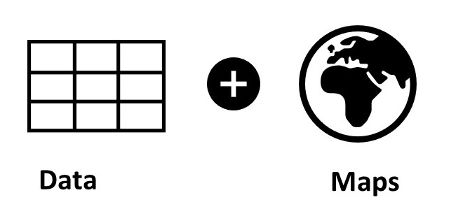
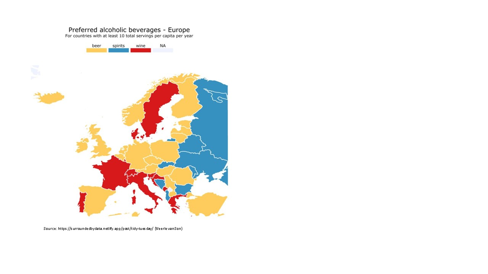

```{r setup, include=FALSE}
knitr::opts_chunk$set(echo=TRUE)
```

#### Loading packages

```{r loading packages}
library(tidyverse)
library(ggplot2)
library(maps)
library(cowplot)
library(knitr)
library(ggrepel)
library(viridis)
```


## Idea: Recreating some Tidy Tuesday maps with {ggplot2}

```{r typical Tidy Tuesday maps}
knitr::include_graphics("maps_1.JPG") #insert image from file
```


## What do we need for these?

```{r data plus maps}

```


## Data

Typical Tidy Tuesday datasets including spatial data

```{r typical Tidy Tuesday spatial datasets}

#with latitude and longitude information indicating geolocations of objects and often numerical data associated with objects

volcano<-readr::read_csv('https://raw.githubusercontent.com/rfordatascience/tidytuesday/master/data/2020/2020-05-12/volcano.csv') #reading in dataset from Tidy Tuesday GitHub repository

head(volcano)


#without lat-long information but labels of states and numerical data per state

cats_dogs<-readr::read_csv('https://raw.githubusercontent.com/rfordatascience/tidytuesday/master/data/2018/2018-09-11/cats_vs_dogs.csv')

head(cats_dogs)

```


## Maps

There are many options for getting map data into R. We will focus on the inbuilt map_data function in {ggplot2} today. It is an easy place to start, especially because most will be familiar with the ggplot2 package. If you move on to different packages later, you will notice that the overall process and challenges encountered are the same. 

#### world map (Mercator projection)

```{r world map}

??map_data #converts map data from maps package into dataframe that can be used in ggplot2

help(package='maps') #documentation of maps package showing available maps

world<-map_data("world") #get map data for world map with map_data command in ggplot2, Mercator projection

View(world)
#long lat = 'corners' of the polygon, group = unique identifier for regions within a region (e.g. Spanish islands, Ibiza = 508, Majorca = 509, Minorca = 510), order = order of points, region = country (e.g. Spain)

aruba<-map_data("world") %>% 
  filter(region=="Aruba")

aruba_points<-ggplot(aruba, aes(x=long, y=lat)) + 
  geom_point(size=3)+
  theme_bw()

aruba_points 

aruba_polygon<-ggplot(aruba, aes(x=long, y=lat)) + 
  geom_polygon()+
  theme_bw()

aruba_polygon


#plot world map, change colour by changing the fill argument, change borders by changing the colour argument  

world_map<-ggplot()+
  geom_polygon(data=world, aes(x=long, y=lat, group=group), fill="white", colour="grey")+
  ggtitle("World map Mercator projection")+
  theme_bw()+
  theme(plot.title=element_text(hjust=0.5))+
  labs(caption="map Natural Earth")

world_map

```

#### world2 map (Pacific-centric projection)

```{r world2 map}

world2<-map_data("world2") 

View(world2)

world2_map<-ggplot()+
  geom_polygon(data=world2, aes(x=long, y=lat, group=group), fill="white", colour="grey")+
  ggtitle("World map Pacific-centric projection")+
  theme_bw()+
  theme(plot.title=element_text(hjust=0.5))+
  labs(caption="map Natural Earth")


world2_map

plot_grid(world_map, world2_map) 
#plot world maps Mercator vs. Pacific-centric projection
```


## Combining data and maps to create plots

Typical maps based on Tidy Tuesday datasets are:

1 Scatter maps (with points indicating geolocations)\
2 Bubble maps (with points indicating geolocations and bubble sizes indicating differences in magnitude of a numeric variable)\
3 Choropleth maps (with colouring of polygon area indicating distribution of a numeric variable)\

```{r maps}
knitr::include_graphics("maps_2.JPG")
```


## 1. Scatter maps

#### Set themes for following plots

```{r setting theme for session}
theme_set(theme_void())
```

#### Using data in lat-long format and renaming latitude and longitude column to lat and long

```{r renaming columns latitude and longitude in volcano df}

head(volcano) #view first 6 rows of data we read in earlier
head(world)

volcano<-volcano %>% 
  rename(lat=latitude, long=longitude) 
#renaming column names latitude and longitude to lat and long as in world dataframe
```

#### Creating scatter map

```{r creating scatter map}

map_volcano_1<-ggplot()+
  geom_polygon(data=world, aes(x=long, y=lat, group=group), fill="grey90", colour="grey70")+
  geom_point(data=volcano, aes(x=long, y=lat), colour="#CF1020", alpha=0.5, size=4)+
  theme_bw()+
  theme(plot.title=element_text(hjust=0.5),
        axis.title.x=element_blank(),
        axis.title.y=element_blank())+
  labs(title="Geolocations of volcanos", caption="Tidy Tuesday 2020-05-12, data from The Smithsonian Institution, map Natural Earth")
  

map_volcano_1

```

For a visualisation of the data with a Pacific-centric projection that shows the Ring of Fire more clearly, see https://evan-canfield.netlify.app/post/volcano-eruptions-tidytuesday/. To create such a map, a different world map has to be used and the projection of the data has to be changed to the format of the map. You can find pointers to solving such an issue in Evan Canfield's Rmd: https://github.com/canfielder/tidytuesday/blob/master/2020-05-12_volcano-eruptions/2020-05-12_volcano-eruptions.Rmd. 

#### Creating scatter map with shapes indicating type of volcano

```{r creating scatter map with group shapes}

volcano$primary_volcano_type<-as.factor(volcano$primary_volcano_type)
summary(volcano$primary_volcano_type)

volcano_4<-volcano %>% 
  filter(primary_volcano_type %in% c("Caldera", "Caldera(s)", "Shield", "Shield(s)", "Stratovolcano", "Stratovolcano(es)", "Stratovolcano?", "Maar(s)"))

#subsetting data to volcanoes of the type Caldera, Shield, Stratovolcano and Maar(s)

volcano_4<-volcano_4 %>% 
  mutate(primary_volcano_type=ifelse(startsWith(as.character(primary_volcano_type), "Caldera"), "Caldera",ifelse(startsWith(as.character(primary_volcano_type), "Stratovolcano"), "Stratovolcano", ifelse(startsWith(as.character(primary_volcano_type), "Shield"), "Shield", "Maar(s)"))))

#subsuming Caldera(s) under Caldera, Shield(s) under Shield, Stratovolcano(es) and Stratovolcano? under Stratovolcano

volcano_4$primary_volcano_type<-as.factor(volcano_4$primary_volcano_type)
summary(volcano_4$primary_volcano_type)

map_volcano_2<-ggplot()+
  geom_polygon(data=world, aes(x=long, y=lat, group=group), fill="grey90", colour="grey70")+
  geom_point(data=volcano_4, aes(x=long, y=lat, shape=primary_volcano_type, colour=primary_volcano_type), size=3)+
  scale_shape_manual(values=c(17, 19, 15, 18))+
  scale_colour_manual(values=c("#ff7f00", "#CF1020", "#377eb8", "#4daf4a"))+
  theme_bw()+
  theme(plot.title=element_text(hjust=0.5),
        axis.title.x=element_blank(),
        axis.title.y=element_blank(),
        legend.title=element_blank())+
  labs(title="Four types of volcanoes around the world", caption="Tidy Tuesday 2020-05-12, data from The Smithsonian Institution, map Natural Earth", fill="Primary volcano type")

map_volcano_2

```

#### Selecting part of scatter map

```{r selecting part of a map}

map_volcano<-ggplot()+
  geom_polygon(data=world, aes(x=long, y=lat, group=group), fill="grey90", colour="grey70")+
  geom_point(data=volcano, aes(x=long, y=lat), colour="#CF1020", alpha=0.5, size=4)+
  theme_bw()+
  theme(axis.title.x=element_blank(),
        axis.title.y=element_blank())+
  labs(caption="Tidy Tuesday 2020-05-12, data from The Smithsonian Institution, map Natural Earth")+
  coord_cartesian(xlim=c(-15, 30), ylim=c(40, 70))
  

#coord_cartesian for specifying section of the map by using coordinates

map_volcano

```

#### Labeling specific datapoints on scatter map

```{r labeling datapoints}

volcano_Germany<-volcano %>% 
  filter (country=="Germany") #subsetting volcano data to volcano in Germany

map_volcano_names_Ger<-ggplot()+
  geom_polygon(data=world, aes(x=long, y=lat, group=group), fill="grey90", colour="grey70")+
  geom_point(data=volcano_Germany, aes(x=long, y=lat), colour="#CF1020", alpha=0.5, size=4)+
  theme_bw()+
  theme(plot.title=element_text(hjust=0.5),
        axis.title.x=element_blank(),
        axis.title.y=element_blank())+
  labs(title="Volcano in Germany", caption="Tidy Tuesday 2020-05-12, data from The Smithsonian Institution, map Natural Earth")+
  coord_cartesian(xlim=c(-15, 30), ylim=c(40, 70))+
  geom_text_repel(data=volcano_Germany,
                  aes(x=long, y=lat, label=volcano_name),
                  size=3, hjust=1, vjust=0)

#adding label with function from package ggrepel

map_volcano_names_Ger

```


## 2. Bubble maps

#### Reading in data

```{r read in eruptions data}

eruptions<-readr::read_csv('https://raw.githubusercontent.com/rfordatascience/tidytuesday/master/data/2020/2020-05-12/eruptions.csv')

eruptions<-eruptions %>% 
  rename(lat=latitude, long=longitude)

summary(eruptions)
#vei = Volcanic Explosivity Index, measure of how explosive volcanic eruptions are
```

#### Creating bubble map

```{r creating bubble map}

map_volcano_vei<-ggplot()+
    geom_polygon(data=world, aes(x=long, y=lat, group=group), fill="grey90", colour="grey70")+
    geom_point(data=eruptions, aes(x=long, y=lat, size=vei), colour="#bb4a54", alpha=0.3) +
      scale_size_continuous(range=c(0,7), breaks=c(0,1,2,3,4,5,6,7)) +
      theme(plot.title=element_text(hjust=0.5),
        axis.title.x=element_blank(),
        axis.title.y=element_blank())+
      labs(title="Explosivity of volcanoes around the world", size="Volcanic Explosivity Index", caption="Tidy Tuesday 2020-05-12, data from The Smithsonian Institution, map Natural Earth")

map_volcano_vei

```


## 3. Choropleth maps

#### Using data with state names and map with state boundaries

```{r head df cats vs dogs get map data state}

head(cats_dogs) #view first 6 rows of data we read in earlier, column with state names is called state

states<-map_data("state")
head(states)#column with state names is called region

```

#### Some data wrangling

```{r data wrangling cats_dogs}

cats_dogs<-cats_dogs %>% 
  rename(region=state) %>% 
  mutate(region=tolower(region)) %>% 
  mutate(region=as.factor(region)) 

#changing column state in cats_dogs to region as in dataframe states, changing first letter in state names to lower case, recoding region to factor (not character)
```

#### Merging numerical data and map data

```{r merging cats_dogs data with map data}

cats_dogs_combined<-cats_dogs %>% 
  left_join(states, cats_dogs, by="region")

#joining dataframe cats_dogs with dataframe states by column region
```

#### Creating choropleth map

```{r creating choropleth map}

map_cats_1<-ggplot(cats_dogs_combined, aes(x=long, y=lat, group=group))+ 
  geom_polygon(aes(fill=avg_cats_per_household), colour="white")+
  labs(title="Average number of cats per household", caption="Tidy Tuesday 2018-09-11, data American Veterinary Medical Association, map US Census Bureau")+
  theme(plot.title=element_text(hjust=0.5),
        legend.title=element_blank())+
  scale_fill_distiller(type="seq", palette="Purples",direction=1) 

#type="seq" (sequential rather than diverging or qualitative), direction = determines order of colours in scale, you can add breaks=c() to change cut-off points (here 1.8, 2.0, 2.2, 2.4, 2.6)

map_cats_1

```

#### Using viridis package for colouring

```{r using viridis package for colouring}

map_cats_2<-ggplot(cats_dogs_combined, aes(x=long, y=lat, group=group))+ 
  geom_polygon(aes(fill=percent_cat_owners), colour="white")+
  labs(title="Percentage of cat owners per state", caption="Tidy Tuesday 2018-09-11, data American Veterinary Medical Association, map US Census Bureau", fill="% cat owners")+
  theme(plot.title=element_text(hjust=0.5))+
  scale_fill_viridis(option="magma")

map_cats_2

```


## 4. Exercises

#### 1) Putting R-Ladies Freiburg on the map

If you like, send a private message to Julia including your name (or nickname/pseudonym) and the geolocation of your city/village in lat-long format. You can go to https://www.latlong.net/ to find the geolocation of your city village. Please use the following format when you send your data: Beke, 54.323292, 10.122765 \
Julia will upload the file "RL_Freiburg_ppl.csv" to the GitHub repo of today's session. If you like, you can return to this exercise when the data are available on GitHub and create a map indicating the geolocations of the participants in today's workshop. You can also try to add the names of the participants to your map.

```{r exercise 1}

RL<-readr::read_csv('https://raw.githubusercontent.com/rladies/meetup-presentations_freiburg/master/2022-03-10-Spatial_data_ggplot/RL_Freiburg_ppl.csv')

map_RL<-ggplot()+
  geom_polygon(data=world, aes(x=long, y=lat, group=group), fill="#D3D3D3")+
  theme_bw()+
  geom_point(data=RL, aes(x=long, y=lat), colour="#871F78", alpha=0.7, size=5)+
  ggtitle("Putting R-Ladies Freiburg on the map")+
  theme(plot.title=element_text(hjust=0.5),
        axis.title.x=element_blank(),
        axis.title.y=element_blank())+
  labs(caption="Geolocation of R-Ladies Freiburg followers, map Natural Earth")+
  geom_text_repel(data=RL,
                  aes(x=long, y=lat, label=name),
                  size=3, hjust=1, vjust=0, max.overlaps=Inf) #adding names, max.overlaps to INF (infinity) so that all names are displayed

map_RL

#if you want to save your plot, you can use the ggsave function
ggsave(filename="R-LadiesMap.png", map_RL, dpi=300,width=21.58, height=11.46, units="cm")

```

#### 2) Map dog owners in the US

Create a choropleth map showing the percentage of dog owners in the different states of the US.

```{r exercise 2}
map_dogs<-ggplot(cats_dogs_combined, aes(x=long, y=lat, group=group))+ 
  geom_polygon(aes(fill=percent_dog_owners), colour="white")+
  labs(title="Percentage of dog owners per state", caption="Tidy Tuesday 2018-09-11, data American Veterinary Medical Association, map US Census Bureau", fill="% dog owners")+
  theme(plot.title=element_text(hjust=0.5))+
  scale_fill_viridis(option="magma")

map_dogs

```

#### 3) Alcohol consumption around the world

Create a choropleth map displaying information about a continuous variable from the alcohol dataset. You can for example show where in the world alcohol consumption in liters of **pure** alcohol per capita was highest in 2010 or where people drank the most beer, wine, spirits. Note that servings are a glass of wine, a can of beer, a shot of spirits and per capita. You can find more details here: https://fivethirtyeight.com/features/dear-mona-followup-where-do-people-drink-the-most-beer-wine-and-spirits/. 

```{r exercise 3}

alcohol<-readr::read_csv('https://raw.githubusercontent.com/rfordatascience/tidytuesday/master/data/2018/2018-06-26/week13_alcohol_global.csv')

head(alcohol, n=40L)

#Often when we work with a dataframe and map data, we encounter the issue that country names are slightly different, which is why the data cannot be merged with the map data for these countries (e.g. the data for **Bosnia-Herzegovina** would not be matched to the country labeled **Bosnia and Herzegovina**). We therefore have to change the country names in the dataframe alcohol to those that are used in the world map data. 

alcohol<-alcohol %>% 
  mutate(country=recode(country, "Antigua & Barbuda"="Antigua",
                        "Bosnia-Herzegovina"="Bosnia and Herzegovina",
                        "Cote d'Ivoire"="Ivory Coast",
                        "Cabo Verde"="Cape Verde",
                        "Congo"="Republic of Congo",
                        "DR Congo"="Democratic Republic of Congo",
                        "Russian Federation"="Russia",
                        "United Kingdom"="UK"))

head(alcohol, n=40L)

#next we will have to rename the column country in the alcohol dataframe to region as it is called in the world map data

alcohol<-alcohol %>% 
  rename(region=country)

world<-map_data("world")

#we can now join the world and alcohol dataframe by region

alcohol_combined<-left_join(world, alcohol, by=c("region"))

#we can then create the choropleth maps

world_map_alcohol<-ggplot(alcohol_combined, aes(x=long, y=lat, group=group))+ 
  geom_polygon(aes(fill=total_litres_of_pure_alcohol), colour="white")+
  labs(caption="Tidy Tuesday 2018-06-26, data from WHO, Mona Chalabi Dear Mona Followup", fill="total liters of pure alcohol consumption")+
  scale_fill_viridis(option="plasma")

world_map_alcohol


world_map_beer<-ggplot(alcohol_combined, aes(x=long, y=lat, group=group))+ 
  geom_polygon(aes(fill=beer_servings), colour="white")+
  labs(caption="Tidy Tuesday 2018-06-26, data from WHO, Mona Chalabi Dear Mona Followup", fill="number of beer servings")+
  scale_fill_viridis(option="plasma")

world_map_beer


world_map_wine<-ggplot(alcohol_combined, aes(x=long, y=lat, group=group))+ 
  geom_polygon(aes(fill=wine_servings), colour="white")+
  labs(caption="Tidy Tuesday 2018-06-26, data from: WHO, Mona Chalabi Dear Mona Followup", fill="number of wine servings")+
  scale_fill_viridis(option="plasma")

world_map_wine


world_map_spirits<-ggplot(alcohol_combined, aes(x=long, y=lat, group=group))+ 
  geom_polygon(aes(fill=spirit_servings), colour="white")+
  labs(caption="Tidy Tuesday 2018-06-26, data from WHO, Mona Chalabi Dear Mona Followup", fill="number of spirit servings")+
  scale_fill_viridis(option="plasma")

world_map_spirits

```

BONUS: Create a choropleth map showing the preferred alcoholic beverage in different European countries (see below).\


```{r map alcoholic beverages Europe}
 #insert image from file
```

```{r Bonus exercise}
#we have to subset the map data to European countries first

europe<-c("Albania", "Andorra", "Austria", "Belarus", "Belgium", "Bosnia and Herzegovina","Bulgaria", "Canary Islands", "Croatia", "Cyprus", "Czech Republic", "Denmark", "Estonia", "Finland", "France", "Germany", "Greece", "Hungary", "Iceland", "Ireland", "Italy", "Kosovo", "Latvia", "Liechtenstein", "Lithuania", "Luxembourg", "Macedonia", "Malta", "Moldova", "Monaco", "Montenegro", "Netherlands", "Norway", "Poland", "Portugal", "Romania", "Russia", "San Marino", "Serbia", "Slovakia", "Slovenia", "Spain", "Sweden", "Switzerland", "Turkey", "UK",  "Ukraine", "Vatican")


europe<-map_data("world") %>% 
  filter(region %in% europe)

# calculating the preferred alcohol per country:
alcohol <- alcohol %>% 
  mutate(preferred_alcohol = case_when(
    beer_servings > wine_servings & beer_servings > spirit_servings ~ "beer",
    wine_servings > beer_servings & wine_servings > spirit_servings ~ "wine",
    spirit_servings > wine_servings & spirit_servings > beer_servings ~ "spirit",
    TRUE ~ "other"),
    preferred_alcohol = as_factor(preferred_alcohol))
alcohol

#next, we will have to join the europe dataframe with the alcohol dataframe

europe_combined<-left_join(europe, alcohol, by=c("region"))

View(europe_combined)

#now we can finally plot our choropleth map with colours for the preferred alcoholic beverage

europe_map_alcohol<-ggplot(europe_combined, aes(x=long, y=lat, group=group))+ 
  geom_polygon(aes(fill=preferred_alcohol), colour="white")+
  ggtitle("Preferred alcoholic beverage in European countries")+
  theme(plot.title=element_text(hjust=0))+
  labs(caption="Tidy Tuesday 2018-06-26, data from WHO, Mona Chalabi Dear Mona Followup", fill="")+
  scale_fill_manual(values=c("gray40", "#ecca00", "#42e9f5", "#ab273e"), na.value="#dfdbd8")+
  coord_cartesian(xlim=c(-27, 50))

europe_map_alcohol

europe_map_alcohol+
  theme(legend.position="top", legend.justification="left")

```

You can find a base-R solution of the bonus task here: https://gitlab.com/-/snippets/1728754 (by Veerle van Son).


There are many other types of spatial data that are not stored in lat-long format but in shape file format that can be converted to simple feature (sf) format. It is also possible to work with sf data in {ggplot2} by using the function geom_sf. Creating maps with {ggplot2} gives you an idea of how you can generally work with spatial data and what challenges you usually face but there are many other packages that can be used (e.g. {mapview}, {tmap}, {leaflet}). These will become relevant when you want to create more sophisticated maps such animated or interactive maps that can also be included in R Shiny dashboards.\
There are also many other types of maps we couldn't cover today. Every November there's the #30DayMapChallenge (https://github.com/tjukanovt/30DayMapChallenge). The tasks from last year might give you an idea of what can be done. As you can see, we've only scratched the surface today (but there are still 236 days until November 1st ;)).

```{r #30DayMapchallenge}
knitr::include_graphics("map_challenge.JPG") #insert image from file
```


