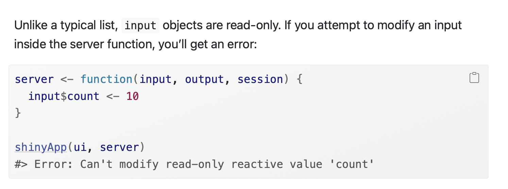
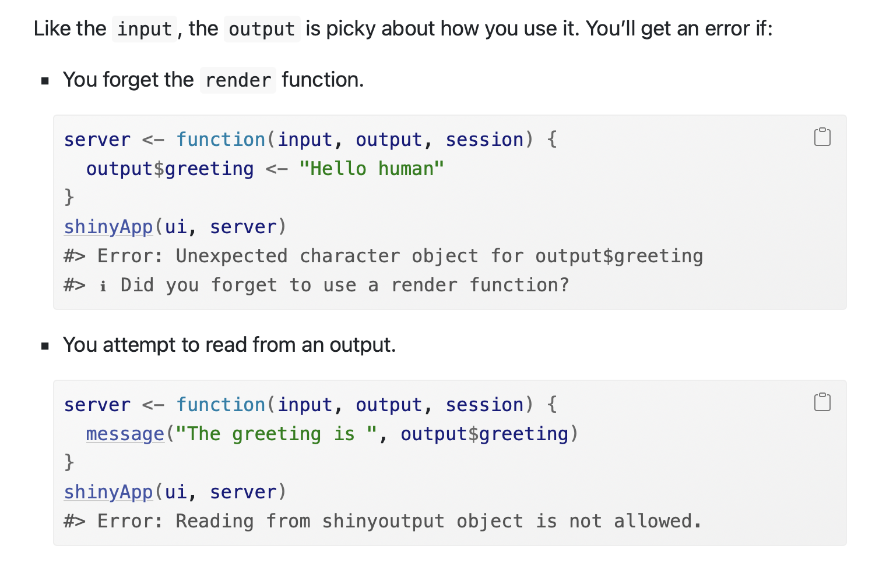

```{r}
library(shiny)
```

# Shiny basics

- Start Shiny from a template via File -> New Project -> New Directory -> Shiny Web Application

- Every Shiny app has three key parts: 

1) The user interface (UI), i.e. what our visitors will see, where they give input, and where they are shown output to match that input
```{r}
ui <- fluidPage(
  "Hello, world!"
)
```

2) The server that takes the input from the user and uses it to customize the output and return it to the UI
```{r}
server <- function(input, output, session) {
}
```

3) The combination of those two parts into one shiny app
```{r}
shinyApp(ui, server)
```


# Input types

## selectInput()
*Drop-down box of options* 
A shorthand selection option is linked to a longer string/R object behind the scenes, and returned to the output layer as text.
```{r}
ui <- fluidPage(
    selectInput(inputId = "greeting", label = "Who do you want to greet?", choices = c("world" = "Hello, world!", "friends" = "Hi, friends!", "people" = "Hey, people!")),
    textOutput("full_greeting")
)

server <- function(input, output, session) {
    output$full_greeting <- renderText(input$greeting)
}

shinyApp(ui, server)
```

## textInput()
*Free-hand text box*
Users can type in any text they want. Note here that the server adds the "greeting" in this case, by concatinating the input with "Hello, " and "!"
```{r}
ui <- fluidPage(
    textInput(inputId = "greeting", label = "Who do you want to greet?", 
              value = "Type your name"), 
    textOutput("full_greeting")
)

# ------------------- Server
server <- function(input, output) {
    output$full_greeting <- renderText({
            paste0("Hello, ", input$greeting, "!")
    })
}


shinyApp(ui, server)
```

## sliderInput()
*Numeric slider*
Set the min, max and default value, and allow participants to drag a slider to show the value they wish to enter.
```{r}
ui <- fluidPage(
    sliderInput("age", label = "How old are you?", min = 1, max = 80, value = 6),
    textOutput("dog_age_greeting")
)

server <- function(input, output, session) {
    output$dog_age_greeting <- renderText({
        dog_age <- input$age * 7
        dog_age_greeting <- paste("That's ", dog_age, " in dog years!")
    })
}

shinyApp(ui, server)
```

# Differences between Shiny and R programming

Imperative vs. declarative programming:
R: "paste together ‘hello’ and the user’s name, then send it to output$greeting" (IMPERATIVE)
Shiny: "if and when you need to send output$greeting to the browser, this is how you should do that" (DECLARATIVE)

R: "ERROR -- You misspelled your variable name as "greting" !!"
Shiny: "Okay, if I ever need to use "greting", now I know how to make it -- no problem here! Guess you just don't want any output!"

R: Order of lines matters! Top to bottom please.
Shiny: I use whatever line I need, based on reactive dependencies -- order doesn't really matter much to me.

R: Functions are useful when things get long, but just writing out what you want to happen in order usually does the trick.
Shiny: Functions help you understand and debug a lot and are basically essential!

# Reactivity

Shiny's *reactivity* is what makes it a little different than programming a regular script. Unlike with a script, each Shiny app must be individualized to the person viewing it (so that they can enter their own inputs and see only the result of their input, not anyone else's!)

Most reactivity happens within the `server` function. This is where input is turned into output!

## Reactivity & input
Input is read-only and you cannot change it, within the server function or anywhere else (leave this to the user!) See below from Mastering Shiny: https://mastering-shiny.org/basic-reactivity.html

```{r}

```

Input also has to read into *reactive context* like `renderText()` as you see in the examples above. There are other reactive contexts like `reactive()` that we'll come across later. *Reactive contexts* allow input to be updated and to update the output that is based on it automatically. Note that this constraint applies to reading from the input (users give input in the UI without needing to be wrapped in a reactive context.)

Recap:
- Input can only be given by the user -- it is read-only to the server
- Input can only be read by the server within a reactive context like `renderText()` or `reactive()`

## Reactivity & output

Output is your alteration of the input, which you want to send to the user. It must always be *rendered* in a render function like `renderText()` in our previous examples. 

The reactive context allows: 
- output to be automatically updated by the input 
- R code to be translated into HTML so that it can be displayed on your app

The output also cannot be read from, only created within the server. See the error below where the server cannot use an output value on the right side of the assignment operator.

```{r}

```

In our examples, the input name and output greeting can be said to have a *reactive dependency* because the calculation of one relies on the changing value of the other!

### Exercise

- Create a new Shiny app that will serve as a party planner. Ask what food the host would like to serve as an text input, then ask how many guests there will be and how many portions of food using two slider inputs. Return how many portions each person will get.

```{r}

library(shiny)

ui <- fluidPage(
    textInput(inputId = "food", label = "What will you serve at your party?"), 
    sliderInput("portions", label = "How many portions are your ordering?", min = 1, max = 200, value = 6),
    sliderInput("guests", label = "How many people are you inviting?", min = 1, max = 100, value = 6),
    textOutput("calculation")
)


server <- function(input, output) {

    output$calculation <- renderText({
        paste("Each guest will receive", as.character(input$portions / input$guests), "servings of", input$food, "!")
    })
}


shinyApp(ui, server)

```


# Shiny in action! 

Let's say we want to recreate this plot from one of our previous Meetups, which shows the total number of medals won in three swimming disciplines in the Paralympics from 1980 to 2016.
```{r}
library(tidyverse)

summary_table <- readr::read_csv('https://raw.githubusercontent.com/rfordatascience/tidytuesday/master/data/2021/2021-08-03/athletes.csv') %>% 
  mutate(medal = factor(medal, levels = c("Bronze", "Silver", "Gold"))) %>% 
  filter(country %in% c("Germany", "France", "Spain", "Italy", "Poland")) %>% 
  group_by(medal, country, year) %>% 
  summarize(N = n())

ggplot(summary_table) +
  aes(x = N, y = medal, fill = medal) +
  geom_col() +
  facet_wrap(~country) +
  theme_minimal() +
  scale_fill_manual(values = c("#AD7C42", "#D4D2C7", "#E4CC08"))
```

## First steps
First, let's see if we can just show the user this base graph on our Shiny server. 

1) We'll need the three core parts of a shiny app -- the UI, the server, and the app itself. Don't forget to load the Shiny package too!

```
library(shiny)

ui <- fluidPage(
  "Hello, world!"
)

server <- function(input, output, session) {
}

shinyApp(ui, server)
```

2) To start, let's add our summary table to the app and display it to the user. For this, we need a new pair of functions: *tableOutput()* in the UI and *renderTable()* in the server. Notice that I also add tidyverse to the apps library.

```
library(shiny)
library(tidyverse)

ui <- fluidPage(
    tableOutput("medals")
)

server <- function(input, output, session) {
    
    output$medals <- renderTable(
        read_csv('https://raw.githubusercontent.com/rfordatascience/tidytuesday/master/data/2021/2021-08-03/athletes.csv') %>% 
            mutate(medal = factor(medal, levels = c("Bronze", "Silver", "Gold"))) %>% 
            filter(country %in% c("Germany", "France", "Spain", "Italy", "Poland")) %>% 
            group_by(medal, country, year) %>% 
            summarize(N = n())
    )
}

shinyApp(ui, server)
```

3) Similarly, we can *renderPlot()* and show *plotOutput()*. Let's add the plot code and change the output to show the plot instead. Note that I've created an objected called summary_table, which doesn't need to be in a reactive context (since it will never change based on the input) and used this to create the graph.

```
library(shiny)
library(tidyverse)

ui <- fluidPage(
    plotOutput("medals")
)

server <- function(input, output, session) {
    
    summary_table <- read_csv('https://raw.githubusercontent.com/rfordatascience/tidytuesday/master/data/2021/2021-08-03/athletes.csv') %>% 
        mutate(medal = factor(medal, levels = c("Bronze", "Silver", "Gold"))) %>% 
        filter(country %in% c("Germany", "France", "Spain", "Italy", "Poland")) %>% 
        group_by(medal, country, year) %>% 
        summarize(N = n())
    
    output$medals <- renderPlot(
        ggplot(summary_table) +
            aes(x = N, y = medal, fill = medal) +
            geom_col() +
            facet_wrap(~country) +
            theme_minimal() +
            scale_fill_manual(values = c("#AD7C42", "#D4D2C7", "#E4CC08"))
    )
}

shinyApp(ui, server)
```

4) Anything that depends on input in a Shiny app must be in a *reactive context* -- the only reactive context we have here is *renderPlot()* So if we later want to be able to let users select which country they want to see, we need to make sure the filtering happens down in this part of the server. 

We don't want to put -too- much in the reactive context, because all that code has to be executed again every time the user changes the input. So it's best to leave creating the summary table to outside of this context and only move the necessary part. 

Also take out the facet_wrap!

```
library(shiny)
library(tidyverse)

ui <- fluidPage(
    plotOutput("medals")
)

server <- function(input, output, session) {
    
    summary_table <- read_csv('https://raw.githubusercontent.com/rfordatascience/tidytuesday/master/data/2021/2021-08-03/athletes.csv') %>% 
        mutate(medal = factor(medal, levels = c("Bronze", "Silver", "Gold"))) %>% 
        group_by(medal, country, year) %>% 
        summarize(N = n())
    
    output$medals <- renderPlot(
        summary_table %>% 
            filter(country == "Germany") %>% 
        ggplot() +
            aes(x = N, y = medal, fill = medal) +
            geom_col() +
            facet_wrap(~country) +
            theme_minimal() +
            scale_fill_manual(values = c("#AD7C42", "#D4D2C7", "#E4CC08"))
    )
}

shinyApp(ui, server)

```

5) Time to add the `selectInput()` to the UI! Here, I am just checking that the input drop-down is shown... but you'll notice that the plot shows Germany every time, regardless of what you select!

```
library(shiny)
library(tidyverse)

ui <- fluidPage(
    selectInput(
        inputId = "country", 
        label = "Which country would you like to see?", 
        choices = c("Germany", "France", Spain", "Italy", "Poland")
                ),
    plotOutput("medals")
)

server <- function(input, output, session) {
    
    summary_table <- read_csv('https://raw.githubusercontent.com/rfordatascience/tidytuesday/master/data/2021/2021-08-03/athletes.csv') %>% 
        mutate(medal = factor(medal, levels = c("Bronze", "Silver", "Gold"))) %>% 
        group_by(medal, country, year) %>% 
        summarize(N = n())
    
    output$medals <- renderPlot(
        summary_table %>% 
            filter(country == "Germany") %>% 
        ggplot() +
            aes(x = N, y = medal, fill = medal) +
            geom_col() +
            facet_wrap(~country) +
            theme_minimal() +
            scale_fill_manual(values = c("#AD7C42", "#D4D2C7", "#E4CC08"))
    )
}

shinyApp(ui, server)
```

6) Since we are already in a reactive context within renderPlot(), we can just change the country to filter to to input$country (since this is the ID we gave it) and we are ready to go!

```
library(shiny)
library(tidyverse)

ui <- fluidPage(
    selectInput(
        inputId = "country", 
        label = "Which country would you like to see?", 
        choices = c("Germany", "France", "Spain", "Italy", "Poland")
                ),
    plotOutput("medals")
)

server <- function(input, output, session) {
    
    summary_table <- read_csv('https://raw.githubusercontent.com/rfordatascience/tidytuesday/master/data/2021/2021-08-03/athletes.csv') %>% 
        mutate(medal = factor(medal, levels = c("Bronze", "Silver", "Gold"))) %>% 
        group_by(medal, country, year) %>% 
        summarize(N = n())
    
    output$medals <- renderPlot(
        summary_table %>% 
            filter(country == input$country) %>% 
        ggplot() +
            aes(x = N, y = medal, fill = medal) +
            geom_col() +
            facet_wrap(~country) +
            theme_minimal() +
            scale_fill_manual(values = c("#AD7C42", "#D4D2C7", "#E4CC08"))
    )
}

shinyApp(ui, server)
```

That's it! We've made our first reactive ggplot in Shiny! 

There's more you can do to make this look more aesthetic, like adding columns and sidebars. However, all the basic parts are there. 

Things to keep in mind with ggplot: 
- Color palettes are your friend! In our example, all countries always had exactly 3 levels of our fill variable, medal (gold, bronze and silver). However, if this can change, you need to have a flexible solution to selecting the correct amount of colors -- and color palettes are great for this! 
- Input changes should be in a reactive context like `reactive()`, `renderPlot()` or `renderTable()`
