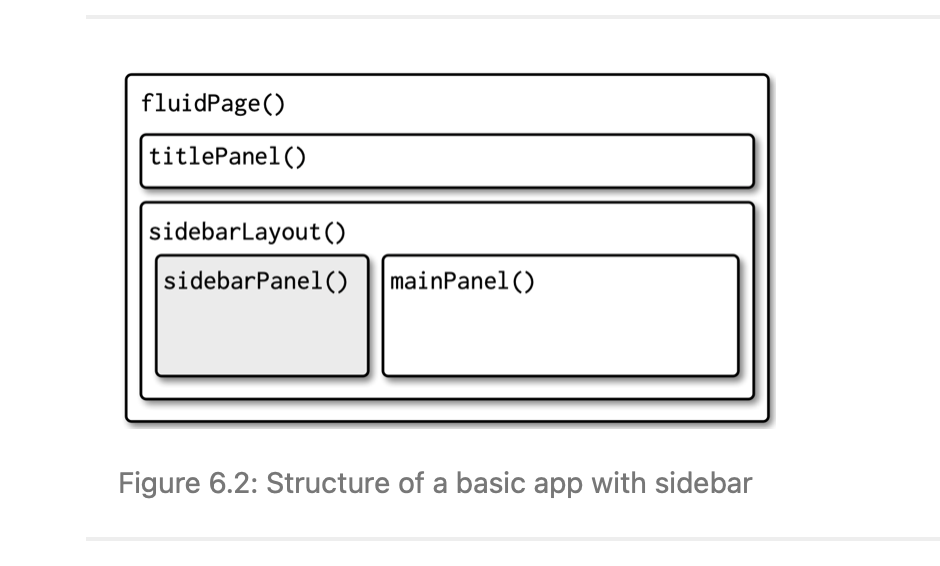
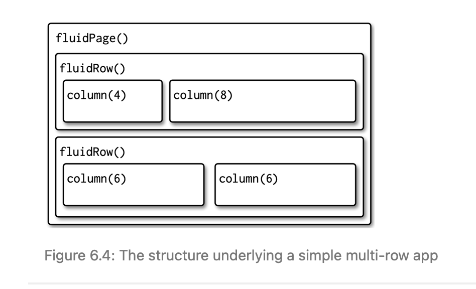

```{r}
library(tidyverse)
library(gt)
```

# Shiny: Pride Edition

Today we'll use data from Data for Progress, via Tidy Tuesday, on Fortune 500 companies, their donations to anti-LGBT legislature, as well as the number of politicians and states that received these donations.

Source: https://github.com/rfordatascience/tidytuesday/tree/master/data/2022/2022-06-07

More info: https://www.dataforprogress.org/accountable-allies

```{r}
pride <- readr::read_csv('https://raw.githubusercontent.com/rfordatascience/tidytuesday/master/data/2022/2022-06-07/static_list.csv')

# This dataset is called static_list on the TT repo
```

# Wrangling

Before we get to the dashboard, let's do some wrangling. The dataset is pretty tidy, but the column names are difficult to work with. 

```{r}
pride <- pride %>% 
  rename(
    "Pride" = "Pride?",
    "HRC" = "HRC Business Pledge",
    "USD" = "Amount Contributed Across States",
    "Politicians" = "# of Politicians Contributed to",
    "States" = "# of States Where Contributions Made"
  )
```

What kind of graph do you want to make with the dataset? Feel free to be creative with your own project. 

I'll do some bar graphs, so there are too many rows! I don't want a bar graph with 126 bars.

```{r}
pride <- pride %>% 
  filter(Company != "Grand Total") %>% 
  top_n(15, USD)
```

For the Shiny app, let's combine all those steps into one, directly on read in. 

```
pride <- readr::read_csv('https://raw.githubusercontent.com/rfordatascience/tidytuesday/master/data/2022/2022-06-07/static_list.csv') %>% 
  rename(
    "Pride" = "Pride?",
    "HRC" = "HRC Business Pledge",
    "USD" = "Amount Contributed Across States",
    "Politicians" = "# of Politicians Contributed to",
    "States" = "# of States Where Contributions Made"
  ) %>% 
  filter(Company != "Grand Total") %>% 
  top_n(15, USD)
```


# Graphing 

What kind of graph do you want to make? And what should our user input modulate? 

I want to make a bar graph:
```{r}
ggplot(pride, aes(x = USD, y = Company)) +
  geom_col()
```
We could easily all do a bar graph by Politicians
```{r}
ggplot(pride, aes(x = Politicians, y = Company)) +
  geom_col()
```

And States
```{r}
ggplot(pride, aes(x = States, y = Company)) +
  geom_col()
```

We could also use custom hex colors! (And reorder our factor levels)

Here is a helpful site for custom palettes: https://htmlcolorcodes.com/color-picker/

If you want to take inspiration from a pride flag: https://en.wikipedia.org/wiki/Pride_flag
And use the image to find the exact hex codes on this site: https://imagecolorpicker.com/en

We can use these inside `scale_fill_manual()`. 
```{r}
ggplot(pride, aes(x = USD, y = reorder(Company, USD), fill = Company)) +
  geom_col(show.legend = FALSE) +
  scale_fill_manual(values = rep(c("#fb9b53", "#d464a4", "#eb7323", "#b35393", "#d42c04", "#a40464"), length.out = 15)) +
  labs(y = NULL) +
  theme_minimal()
```

In our app, I'd like to let users select a certain company to be able to highlight in yellow. In order to do that, let's make a new column with random group placeholders for different colors. 

Then, we can change one of these placeholders to "AA" -- corresponding to the first color in our manual list -- to be able to highlight it. 
```{r}
pride$hex <- rep(c("B", "C", "D", "E", "F", "G"), length.out = 15)

pride %>% 
  mutate(hex = ifelse(Company == "Amazon", "AA", hex)) %>% 
ggplot(aes(x = USD, y = reorder(Company, USD), fill = hex)) +
  geom_col(show.legend = FALSE) +
  scale_fill_manual(values = c("yellow", "#fb9b53", "#d464a4", "#eb7323", "#b35393", "#d42c04", "#a40464")) +
  labs(y = NULL) +
  theme_minimal()
```

### Try it
Take a moment to find some hex codes you want to use, and apply them to the code with any aesthetic improvements you want to make. Keep in mind that the number of group placeholders you select needs to match the amount of hex codes you provide.
```{r}

```


# Table

Let's make a simple gt() that shows one company's data in numeric form:
```{r}
pride %>% 
  filter(Company == "Amazon") %>% 
  gt()
```

Drop the hex row that we made above just for making our plot. 


We could also spend some time making our gt() more beautiful, but for now I'll just format our USD column.
```{r}
pride %>% 
  filter(Company == "Amazon") %>% 
  select(-hex) %>% 
  gt() %>% 
   fmt_currency(
    columns = USD,
    currency = "USD"
  ) 
  
```


# Workflow

Now that we have our data ready to go and have figured out what to work with, we can make our Shiny app. 

Some helpful shortcuts: 
- Open a new R file and type shinyapp then press Shift + Tab 

- Run the app with Ctrl/Cmd + Shift + Enter


## (1) Set up layout
First of all, let's set up our layout. 

```{r}

```
Mastering Shiny Figure 6.2
https://mastering-shiny.org/action-layout.html


This is the layout we used for a previous app on Eurovision results. Take a moment to look at the code below:

```
library(shiny)
library(tidyverse)

ui <- fluidPage(
  
  titlePanel("Eurovision Results"), 
  
  sidebarLayout(
    sidebarPanel(
    selectInput(inputId = "year", 
                label = "Which year would you like to see?", 
                choices = c(2004:2019, 2021, 2022)
    ),
    sliderInput(inputId = "rank",
                label = "How many countries would you like to see?",
                max = 24,
                min = 2,
                value = 3),
    ),
    mainPanel(
    textOutput("title"),
    textOutput("subtitle"),
    plotOutput("winner_plot")
    )
)
)

server <- function(input, output, session) {
  
  eurovision <- readr::read_csv('https://raw.githubusercontent.com/rfordatascience/tidytuesday/master/data/2022/2022-05-17/eurovision.csv') %>% 
    filter(section == "grand-final")
  
  output$winner_plot <- renderPlot(
    eurovision %>% 
      filter(year == input$year & rank <= input$rank) %>% 
      ggplot(aes(x = reorder(artist_country, -total_points), y = total_points, fill = artist_country)) +
        geom_col(show.legend = F) +
        labs(
          y = "Total points",
          x = "Country"
        ) + 
      theme_minimal() + 
      theme(axis.text.x = element_text(angle = 45, vjust = 0.8))
    ) 
  
  output$title <- renderText(
    paste("Eurovision Contest Placement in", input$year)
  )
  
  output$subtitle <- renderText(
    paste("The top", input$rank, "countries in terms of total points")
  )
}


shinyApp(ui, server)
```


```{r}

```
Let's create something similar to this for our app! 

Here is some sample code for making a layout like the one above.
```
fluidPage(
  fluidRow(
    column(4, 
      ...
    ),
    column(8, 
      ...
    )
  ),
  fluidRow(
    column(6, 
      ...
    ),
    column(6, 
      ...
    )
  )
)
```

### Try it

Open a new Shiny app and insert the template using the keyboard shortcut. Setup your panel structure in the UI function using the example code above, but make both rows have a column of width 4 and a column of width 8. Then, add a title panel above everything else too!

Don't forget that objects in the UI are separated by commas.

To make your app run, add a title, and fill each of the cells in your layout with some text -- you can simply add text in the location you want it to show up, e.g. "input here", "table here", as placeholders

And don't forget to load the packages we'll need: shiny, tidyverse, and gt! 

### Spoiler
```
library(shiny)
library(tidyverse)
library(gt)

ui <- fluidPage(
  titlePanel(
    "Pride"
  ),
  
  fluidRow(
    column(4, 
           "input here"
    ),
    column(8, 
           "table here"
    )
  ),
  
  fluidRow(
    column(4, 
           "input here"
    ),
    column(8, 
           "plot here"
    )
  )
)

server <- function(input, output, session) {
  
}

shinyApp(ui, server) 
```

## (2) Add data and plot

Now, let's read in the data and add our (still just static plot). 

First, a few things to remember about Shiny: 

- The UI (or "user interface") is where input is collected, e.g. as...
  - `selectInput()`
  - `textInput()`
  - `slideInput()`
  
- In the UI, we also show output, e.g.
  - `textOutput()`
  - `tableOutput()`
  - `plotOutput()`
  
- In the server, we take input and transform it into output. 
  - Input is read-only to the server
  - Input has to be read in within a reactive context, and output should be created from a reactive context too:
    - `renderText()`
    - `renderPlot()`
    - `reactive()`
  - Anything inside of a reactive context is updated every time the user changes the input -- so some processes, like reading in data, should not be in reactive contexts so that they're not always repeated
  
- Once it has been rendered, the output should be saved in the server with the format output$name and called in the UI with the appropriate output command, i.e. plotOutput("name")
  - In the server: 
      output$name_of_thing <- renderPlot(
        ...
      )
  - In the UI: 
    plotOutput("name_of_thing")

  
### Try it

Let's load in the data, our table and our plot. We won't collect user input yet, but leave them static.

To get used to an iterative Shiny development workflow, run the app with Ctrl/Cmd + Shift + Enter every time you add something, to make sure there aren't any errors.

Hint: 
Loading in data, and rendering the table and plot should happen in the server function. 
The resulting plot and table should be displayed in the UI. 

Don't forget to add your hex code column!


### Spoiler
```
library(shiny)
library(tidyverse)
library(gt)

ui <- fluidPage(
  titlePanel(
    "Pride"
  ),
  
  fluidRow(
    column(4, 
           "input here"
    ),
    column(8, 
           tableOutput("company_table")
    )
  ),
  
  fluidRow(
    column(4, 
           "input here"
    ),
    column(8, 
           plotOutput("pride_plot")
    )
  )
)

server <- function(input, output, session) {
  
  pride <- readr::read_csv('https://raw.githubusercontent.com/rfordatascience/tidytuesday/master/data/2022/2022-06-07/static_list.csv') %>% 
    rename(
      "Pride" = "Pride?",
      "HRC" = "HRC Business Pledge",
      "USD" = "Amount Contributed Across States",
      "Politicians" = "# of Politicians Contributed to",
      "States" = "# of States Where Contributions Made"
    ) %>% 
    filter(Company != "Grand Total") %>% 
    top_n(15, USD)
  
  output$company_table <- renderTable(
    pride %>% 
      filter(Company == "Amazon") %>% 
      select(-hex) %>% 
      gt() %>% 
      fmt_currency(
        columns = USD,
        currency = "USD"
      )
  )
  
  pride$hex <- rep(c("B", "C", "D", "E", "F", "G"), length.out = 15)
  
   output$pride_plot <- renderPlot(
     pride %>% 
       mutate(hex = ifelse(Company == "Amazon", "AA", hex)) %>% 
       ggplot(aes(x = USD, y = reorder(Company, USD), fill = hex)) +
       geom_col(show.legend = FALSE) +
       scale_fill_manual(values = c("yellow", "#fb9b53", "#d464a4", "#eb7323", "#b35393", "#d42c04", "#a40464")) +
       labs(y = NULL) +
       theme_minimal()
  )
  
 
}

shinyApp(ui, server) 
```

# (3) Allow input

Say we want to allow users to toggle through a graph of the amount donated, the politicians donated to and the states donated to. Let's add a drop-down list (`selectInput()`) for these options. 

One way to retrieve all company names in alphabetical order would be:
```{r}
pride %>% 
  distinct(Company) %>% 
  arrange(Company) %>% 
  as.list() #Easier format to copy-paste...
```

Let's also add a drop-down list to choose which bar graph to show: total donated, states donated in, or politicians donated to. 

Remember, you can either use the exact name of the R object in the drop down, or set up the drop-down so that a different text is showed to the user than what the server receives, i.e. 
selectInput(
  choices = c("Long wordy version for user" = "col_name")
)

So you can type out a description for the user, but link to the column name behind-the-scenes for use later.

First, just add the appropriate input objects, but leave the plots static. We'll make them interactive in the next step. 
### Try it
- Add the two input objects: one for the company and one for the type of bar graph

### Spoiler
```
library(shiny)
library(tidyverse)
library(gt)

ui <- fluidPage(
  titlePanel(
    "Is your favorite company donating to anti-LGBTQIA* law-makers?"
  ),
  
  fluidRow(
    column(4, 
           selectInput(
             inputId = "table_company",
             label = "Company:",
             choices = c("Amazon", "American Electric Power", "AT&T", "Berkshire Hathaway", "Charter Communications", "Comcast", "Enterprise Products Partners", "FedEx", "State Farm", "Tenet Healthcare", "Toyota", "Union Pacific", "UnitedHealth Group", "Valero Energy", "Vistra")
           )
    ),
    column(8, 
           tableOutput("company_table")
    )
  ),
  
  fluidRow(
    column(4, 
           selectInput(
             inputId = "show_plot",
               label = "Show:",
               choices = c("Total donation" = "USD",
                          "Politicans donated to" = "Politicians",
                           "States donated in" = "States")
           )
    ),
    column(8, 
           plotOutput("pride_plot")
    )
  )
)

server <- function(input, output, session) {
  
  pride <- readr::read_csv('https://raw.githubusercontent.com/rfordatascience/tidytuesday/master/data/2022/2022-06-07/static_list.csv') %>% 
    rename(
      "Pride" = "Pride?",
      "HRC" = "HRC Business Pledge",
      "USD" = "Amount Contributed Across States",
      "Politicians" = "# of Politicians Contributed to",
      "States" = "# of States Where Contributions Made"
    ) %>% 
    filter(Company != "Grand Total") %>% 
    top_n(15, USD)
  
  output$company_table <- renderTable(
    pride %>% 
      filter(Company == "Amazon") %>% 
      select(-hex) %>% 
      gt() %>% 
      fmt_currency(
        columns = USD,
        currency = "USD"
      )
  )
  
  pride$hex <- rep(c("B", "C", "D", "E", "F", "G"), length.out = 15)
  
   output$pride_plot <- renderPlot(
     pride %>% 
       mutate(hex = ifelse(Company == "Amazon", "AA", hex)) %>% 
       ggplot(aes(x = USD, y = reorder(Company, USD), fill = hex)) +
       geom_col(show.legend = FALSE) +
       scale_fill_manual(values = c("yellow", "#fb9b53", "#d464a4", "#eb7323", "#b35393", "#d42c04", "#a40464")) +
       labs(y = NULL) +
       theme_minimal()
  )
  
 
}

shinyApp(ui, server) 
```

## (4) Update table

As our first reactive component, let's have the table update to show the country that has been selected from the drop-down list. 

What do you have to change to achieve this?

### Spoiler
```
library(shiny)
library(tidyverse)
library(gt)

ui <- fluidPage(
  titlePanel(
    "Is your favorite company donating to anti-LGBTQIA* law-makers?"
  ),
  
  fluidRow(
    column(4, 
           selectInput(
             inputId = "table_company",
             label = "Company:",
             choices = c("Amazon", "American Electric Power", "AT&T", "Berkshire Hathaway", "Charter Communications", "Comcast", "Enterprise Products Partners", "FedEx", "State Farm", "Tenet Healthcare", "Toyota", "Union Pacific", "UnitedHealth Group", "Valero Energy", "Vistra")
           )
    ),
    column(8, 
           tableOutput("company_table")
    )
  ),
  
  fluidRow(
    column(4, 
           selectInput(
             inputId = "show_plot",
             label = "Show:",
             choices = c("Total donation" = "USD",
                         "Politicans donated to" = "Politicians",
                         "States donated in" = "States")
           )
    ),
    column(8, 
           plotOutput("pride_plot")
    )
  )
)

server <- function(input, output, session) {
  
  pride <- readr::read_csv('https://raw.githubusercontent.com/rfordatascience/tidytuesday/master/data/2022/2022-06-07/static_list.csv') %>% 
    rename(
      "Pride" = "Pride?",
      "HRC" = "HRC Business Pledge",
      "USD" = "Amount Contributed Across States",
      "Politicians" = "# of Politicians Contributed to",
      "States" = "# of States Where Contributions Made"
    ) %>% 
    filter(Company != "Grand Total") %>% 
    top_n(15, USD)
  
  output$company_table <- renderTable(
    pride %>% 
      filter(Company == input$table_company) %>% 
      select(-hex) %>% 
      gt() %>% 
      fmt_currency(
        columns = USD,
        currency = "USD"
      )
    
  )
  
  pride$hex <- rep(c("B", "C", "D", "E", "F", "G"), length.out = 15)
  
  output$pride_plot <- renderPlot(
    pride %>% 
      mutate(hex = ifelse(Company == "Amazon", "AA", hex)) %>% 
      ggplot(aes(x = USD, y = reorder(Company, USD), fill = hex)) +
      geom_col(show.legend = FALSE) +
      scale_fill_manual(values = c("yellow", "#fb9b53", "#d464a4", "#eb7323", "#b35393", "#d42c04", "#a40464")) +
      labs(y = NULL) +
      theme_minimal()
  )
  
  
}

shinyApp(ui, server) 

```

## (5) Update highlighting

Now, let's make the country selected in the first input box (and showed in the table) also be highlighted in the graph.

You'll need an extra trick here (and there may be a better way to do this):
  - When you collect input from users in Shiny, the information is not saved as a string and is not a competely typical variable
  - If you need to pull out the information in the input variable as a string, one (slightly messy) way to do it is with `paste()`
  - So here, we will need to wrap our input variable in `paste()` so that it is read by the `mutate()` command as a string
  
Here is my solution to this point:
```
  output$pride_plot <- renderPlot(
    pride %>% 
      mutate(hex = ifelse(Company == paste(input$table_company), "AA", hex)) %>% 
      ggplot(aes(x = USD, y = reorder(Company, USD), fill = hex)) +
      geom_col(show.legend = FALSE) +
      scale_fill_manual(values = c("yellow", "#fb9b53", "#d464a4", "#eb7323", "#b35393", "#d42c04", "#a40464")) +
      labs(y = NULL) +
      theme_minimal()
  )
  
```

# (6) Update bar chart

Finally, we can use user input to update the bar chart. 

To do this, we need to understand a little about how tidyverse's *tidy evaluation* works. Behind the scenes, tidyverse commands like `filter()` are assuming that the varibales you pass them will be subsets of the data, i.e. that "Company" means "pride$Company". 

Spelled out, what is happening is: 
```{r}
pride %>% 
  filter(.data$USD > 100000)
```

In Shiny, you may have to be explicit about this when you are taking user input about data variables, like column names. 
And ggplots `aes()` works in exactly the same way!

So when you want users to input column names to change the axes of a ggplot, you have to let `aes()` know that you still mean to use a data variable:
```
output$pride_plot <- renderPlot(
     pride %>% 
       mutate(hex = ifelse(Company == paste(input$table_company), "AA", hex)) %>% 
       ggplot(aes(x = .data[[input$show_plot]], y = reorder(Company, USD), fill = hex)) +
       geom_col(show.legend = FALSE) +
       scale_fill_manual(values = c("yellow", "#fb9b53", "#d464a4", "#eb7323", "#b35393", "#d42c04", "#a40464")) +
       labs(y = NULL) +
       theme_minimal()
  )
  
```

And we can do that again to reorder data by the selected column as well:
```
output$pride_plot <- renderPlot(
     pride %>% 
       mutate(hex = ifelse(Company == paste(input$table_company), "AA", hex)) %>% 
       ggplot(aes(x = .data[[input$show_plot]], y = reorder(Company, .data[[input$show_plot]]), fill = hex)) +
       geom_col(show.legend = FALSE) +
       scale_fill_manual(values = c("yellow", "#fb9b53", "#d464a4", "#eb7323", "#b35393", "#d42c04", "#a40464")) +
       labs(y = NULL) +
       theme_minimal()
  )
  
```


# (7) Add theme

To your UI, right at the top, add: 
```
theme = bslib::bs_theme(bootswatch = "united"),
```

To set a pre-set theme for your whole app! 

Try switching out "united" for one of the following options:
“cerulean”, “cosmo”, “cyborg”, “darkly”, “flatly”, “journal”, “litera”, “lumen”, “lux”, “materia”, “minty”, “pulse”, “sandstone”, “simplex”, “sketchy”, “slate”, “solar”, “spacelab”, “superhero”, “united”, “yeti”

Others here: 
https://bootswatch.com


What about the plots?

To make them match, first install the thematic package.

Then add the following code to your server function:
```
thematic::thematic_shiny()
```

# Final product!

```
library(shiny)
library(tidyverse)
library(gt)

ui <- fluidPage(
  theme = bslib::bs_theme(bootswatch = "journal"),
  titlePanel(
    "Is your favorite company donating to anti-LGBTQIA* law-makers?"
  ),
  
  fluidRow(
    column(4, 
           selectInput(
             inputId = "table_company",
             label = "Company:",
             choices = c("Amazon", "American Electric Power", "AT&T", "Berkshire Hathaway", "Charter Communications", "Comcast",                     
                         "Enterprise Products Partners", "FedEx", "State Farm", "Tenet Healthcare", "Toyota", "Union Pacific",           
                         "UnitedHealth Group", "Valero Energy", "Vistra")
           )
    ),
    column(8, 
           tableOutput("company_table")
    )
  ),
  
  fluidRow(
    column(4, 
           selectInput(
             inputId = "show_plot",
               label = "Show:",
               choices = c("Total donation" = "USD",
                          "Politicans donated to" = "Politicians",
                           "States donated in" = "States")
           )
    ),
    column(8, 
           plotOutput("pride_plot")
    )
  )
)

server <- function(input, output, session) {
  
  thematic::thematic_shiny()
  
  pride <- readr::read_csv('https://raw.githubusercontent.com/rfordatascience/tidytuesday/master/data/2022/2022-06-07/static_list.csv') %>% 
    rename(
      "Pride" = "Pride?",
      "HRC" = "HRC Business Pledge",
      "USD" = "Amount Contributed Across States",
      "Politicians" = "# of Politicians Contributed to",
      "States" = "# of States Where Contributions Made"
    ) %>% 
    filter(Company != "Grand Total") %>% 
    top_n(15, USD)
  
  output$company_table <- renderTable(
    pride %>% 
      filter(Company == input$table_company) %>% 
      select(-hex) %>% 
      gt() %>% 
      fmt_currency(
        columns = USD,
        currency = "USD"
      )
    
  )
  
  
  pride$hex <- rep(c("B", "C", "D", "E", "F", "G"), length.out = 15)
  
  
   output$pride_plot <- renderPlot(
     pride %>% 
       mutate(hex = ifelse(Company == paste(input$table_company), "AA", hex)) %>% 
       ggplot(aes(x = .data[[input$show_plot]], y = reorder(Company, .data[[input$show_plot]]), fill = hex)) +
       geom_col(show.legend = FALSE) +
       scale_fill_manual(values = c("yellow", "#fb9b53", "#d464a4", "#eb7323", "#b35393", "#d42c04", "#a40464")) +
       labs(y = NULL) +
       theme_minimal()
  )
  
 
  
}

shinyApp(ui, server) 

```